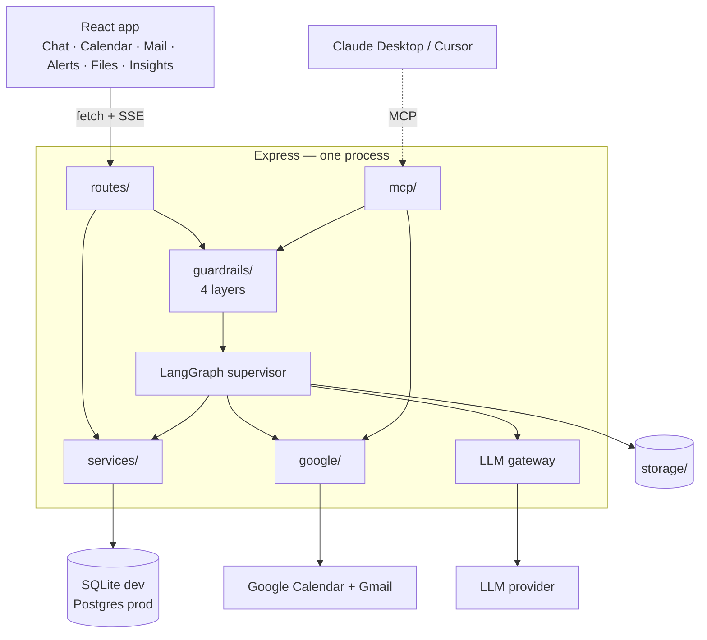

# AI Secretary

One multi-agent assistant that chats, searches the web, writes code, generates
PDFs and slide decks, reads images and documents — and works with your real
Google Calendar and Gmail.

TypeScript end to end. LangChain + LangGraph for the agents. MCP so other tools
can use the same capabilities.

```
┌─────────────────────────────────────────────────────────────┐
│  "Find the thread about the launch, book 30 minutes with    │
│   everyone on it, and remind me an hour before."            │
└─────────────────────────────────────────────────────────────┘
                              ↓
        router → workspace agent → search_mail
                                 → find_free_slot
                                 → create_meeting
                                 → create_reminder
                              ↓
        "Booked 'Launch sync' Thu 14:00–14:30 with 4 people.
         Meet link added, reminder set for 13:00."
```

---

## What it does

| | |
|---|---|
| 💬 **Chat** | General conversation with conversation memory |
| 📅 **Calendar** | List, create, reschedule, cancel; check availability; find free slots |
| 📧 **Mail** | Search with Gmail syntax, read, send, reply in-thread, mark read |
| 🔔 **Notifications** | Meeting reminders and mail nudges, pushed live, no polling |
| 🔍 **Web search** | Fresh information with inline citations |
| 📄 **PDF generation** | A structured, multi-section document, downloadable |
| 📊 **Slide decks** | A themed 9-slide `.pptx` with three layouts |
| 🖼️ **Image generation** | Prompt-enhanced, stored locally |
| 👁️ **Vision** | Upload an image: describe it, extract text, explain charts |
| 📑 **Document Q&A** | Upload a PDF and ask questions, answered only from the document |
| 💻 **Code** | Build projects as artifacts with a live preview, or review existing code |
| 🔌 **MCP** | The same calendar and mail tools in Claude Desktop or Cursor |
| 🛡️ **Guardrails** | Four layers, including human approval before any irreversible action |
| 🧪 **Evals** | 44 offline cases that run in under a second with no API key |
| 📊 **Insights** | Cost, latency and guardrail activity per agent |

---

## Quick start

```bash
npm install
cp .env.example server/.env        # then fill it in — see docs/08-SETUP.md
cp web/.env.example web/.env
npm run db:push
npm run dev
```

Open <http://localhost:5173>.

You need **two things** in `server/.env`: a Google OAuth client (sign-in +
Calendar + Gmail in one consent) and one LLM API key. Full walkthrough in
[docs/08-SETUP.md](docs/08-SETUP.md).

```bash
npm run eval       # 44 offline cases, ~40ms, no API key needed
npm run build      # typecheck + build both workspaces
npm run mcp        # MCP stdio server for Claude Desktop / Cursor
```

**Deploy:** `cp .env.example .env`, set `SESSION_SECRET` and your keys, then
`docker compose up --build` runs the production stack (app + Postgres, migrations
applied on boot) on <http://localhost:4000>. Four hosting options in
[docs/10-DEPLOYMENT.md](docs/10-DEPLOYMENT.md).

---

## Stack

| Layer | Choice | Why |
|---|---|---|
| Language | TypeScript, both ends | one language, one mental model |
| Agents | LangChain + LangGraph (JS) | explicit graph, inspectable state |
| Backend | Node + Express 5 | one process, no gateway |
| Database | SQLite (dev) / Postgres (prod) + Prisma | zero install locally; the Docker image runs committed Postgres migrations |
| Auth | Google OAuth 2.0 + JWT cookie | one consent does sign-in *and* data access |
| Frontend | React 19 + Vite + Tailwind v4 | fast, no SSR needed |
| State | Zustand | three small stores, no boilerplate |
| Streaming | Server-Sent Events | one-directional, rides on plain HTTP |
| Interop | Model Context Protocol | stdio + Streamable HTTP |
| LLM gateway | in-process, or OpenRouter | retry, timeout, fallback, cache, cost |
| Evals | a 300-line runner, no framework | offline suite needs no API key |

**Local development needs no Docker, no Redis, no MongoDB, no vector database,
no S3 and no cloud account** beyond the API keys. Docker is only for the
production image.

---

## The architecture in one picture



A **router** node picks one of nine agents. Eight answer in one pass. The ninth,
`workspace`, is a ReAct loop with 16 calendar, mail and notification tools, and
it is what makes multi-step requests work.

Every model call goes through one gateway (retry, timeout, fallback, cache, cost),
and every run is bracketed by guardrails and recorded as a trace.

---

## Documentation

Thirteen guides in reading order. Each links to the next — start at the top and
keep going. Full index: [docs/README.md](docs/README.md).

| # | Document | What you get |
|---|---|---|
| 01 | [Overview](docs/01-OVERVIEW.md) | what this is, a 10-minute tour of the whole system |
| 02 | [Concepts](docs/02-CONCEPTS.md) | **every concept taught with the real code** — tools, LangGraph, ReAct, RAG, MCP, SSE, OAuth, injection |
| 03 | [Architecture](docs/03-ARCHITECTURE.md) | the design and every trade-off, with diagrams |
| 04 | [File guide](docs/04-FILE-GUIDE.md) | all 90 files: what each does and the one detail worth knowing |
| 05 | [Data flows](docs/05-DATA-FLOWS.md) | eight requests traced end to end |
| 06 | [Guardrails](docs/06-GUARDRAILS.md) | the four safety layers, and the attack that shapes them |
| 07 | [Evals and gateway](docs/07-EVALS.md) | how correctness is measured; retry, fallback, cost |
| 08 | [Setup](docs/08-SETUP.md) | Google Cloud, keys, MCP config, troubleshooting |
| 09 | [Build order](docs/09-BUILD-ORDER.md) | type it out yourself, 16 checkpoints |
| 10 | [Deployment](docs/10-DEPLOYMENT.md) | Docker, Postgres, four hosting options, HTTPS, CI |
| 11 | [Interview guide](docs/11-INTERVIEW-GUIDE.md) | the questions you will be asked, and how to answer them |
| 12 | [Observability](docs/12-OBSERVABILITY.md) | what a run records, the metrics, what is **not** logged |
| 13 | [Decisions](docs/13-DECISIONS.md) | 15 architecture decisions with trade-offs and "revisit when" |

**Shortest useful path:** [01 Overview](docs/01-OVERVIEW.md) →
[02 Concepts](docs/02-CONCEPTS.md) → open
[`server/src/ai/graph.ts`](server/src/ai/graph.ts). It is 130 lines, and the whole
agent system fits in your head from there.

**Want it running?** [08 Setup](docs/08-SETUP.md). **Want it deployed?**
[10 Deployment](docs/10-DEPLOYMENT.md).

---

## Layout

```
ai-secretary/
├── docs/                  thirteen guides + an index
├── server/
│   ├── prisma/            schema.prisma — 9 models (SQLite, edit this)
│   │   └── postgres/      generated Postgres schema + committed migrations
│   ├── scripts/           postgres-schema.mjs — keeps the two schemas in sync
│   └── src/
│       ├── lib/           errors · SSE · storage · time
│       ├── auth/          OAuth · sessions · the gate
│       ├── guardrails/    policy · input · output · tool gate · trust boundary
│       ├── google/        calendar.ts · gmail.ts  (framework-free)
│       ├── ai/            graph · router · state · models · gateway · pricing
│       │   ├── agents/    9 agents
│       │   └── tools/     16 tools in 3 files
│       ├── generators/    pdf · pptx
│       ├── services/      conversations · credits · limits · alerts · cron · traces
│       ├── routes/        9 route files
│       ├── mcp/           tools · http · stdio
│       └── evals/         44 offline cases + 21 live
└── web/src/
    ├── lib/               api · sse · types
    ├── store/             auth · chat · notifications
    ├── components/        layout · markdown · chat/ (incl. ApprovalCard)
    └── pages/             Login · Chat · Calendar · Mail · Alerts · Files · Insights
```

---

## A few decisions worth knowing

**One Google consent, not two auth systems.** Signing in *is* the calendar and
mail grant. There is no second "connect your calendar" step.

**Charge before the work, refund if it throws.** `runBilled()` wraps every agent:
rate limit → charge → run → refund on failure. Charging afterwards lets an empty
wallet burn paid API calls.

**One implementation, three front doors.** `google/calendar.ts` and
`google/gmail.ts` have no framework types, so the agent tools, the REST routes
and the MCP server all share them. Browsing your inbox costs nothing; asking the
agent to act costs a model call.

**The model never names a user.** `userId` is closed over when tools are built,
never passed as a tool argument.

**Tagged text, not JSON, for structured generation.** Model JSON fails a dozen
ways and each failure wastes a paid call. A line format degrades: skip the bad
line, render the rest.

**Preferences are the long-term memory.** Say *"I'm in IST, default my meetings
to 45 minutes"* once and every future conversation knows it.

**Writes need a human; reads do not.** `send_mail`, `reply_to_mail` and
`cancel_meeting` write a proposal row instead of acting. The approve request runs
the stored arguments with **no model involved**, so what executes is exactly what
the user read. This is the one guardrail that cannot be talked around — and MCP
gets it too.

**Tool results from the outside world are wrapped as untrusted data.** The agent
reads email, so anyone can put text in its context. See
[06-GUARDRAILS](docs/06-GUARDRAILS.md).

---

## Credits

Each agent run costs from a per-user wallet (500 to start).

| Agent | Cost | | Agent | Cost |
|---|---|---|---|---|
| chat | 1 | | pdf | 10 |
| workspace | 3 | | ppt | 10 |
| search | 5 | | image | 10 |
| docqa | 5 | | vision | 10 |
| coding | 10 | | | |

Rate limits are per user, per agent, per minute — 20 for chat down to 3 for
image. `grantCredits()` in `services/credits.service.ts` is where a payment
provider would hook in.

Actual spend, per agent, is on the **Insights** page.

---

## Evals

```bash
npm run db:push           # once, after install: generates the Prisma client
npm run eval              # 44 cases, ~40ms, no API key needed
npm run eval -- --live    # + 21 router-accuracy cases
```

The offline suite covers every guardrail and both output parsers, so it is
runnable in CI with no credentials — which is the usual reason eval suites get
switched off. It found three real bugs on its first run; they are written up in
[07-EVALS §7.5](docs/07-EVALS.md).

---

## Design notes

A few choices worth knowing about, and the reasoning behind each:

| Choice | Why |
|---|---|
| **One process, not microservices** | the pieces all scale with the same traffic, so splitting them buys deployment independence nobody needs here — and costs a reader the ability to follow a request end to end |
| **No Redis** | the rate limiter and the router cache are per-process and correct for one instance. [13-DECISIONS](docs/13-DECISIONS.md) records exactly when that stops being true |
| **No vector database** | document Q&A embeds one PDF, answers one question and throws the index away. A linear scan over a few hundred chunks is microseconds |
| **Local file storage** | generated PDFs are served by the app, so links in old conversations never expire. `lib/storage.ts` is the single file to rewrite for S3 |
| **SQLite in dev, Postgres in prod** | zero install locally; one generated schema and a committed migration for the container |

Every one of these is written up with its trade-off and its "revisit when…"
trigger in [13-DECISIONS.md](docs/13-DECISIONS.md).
