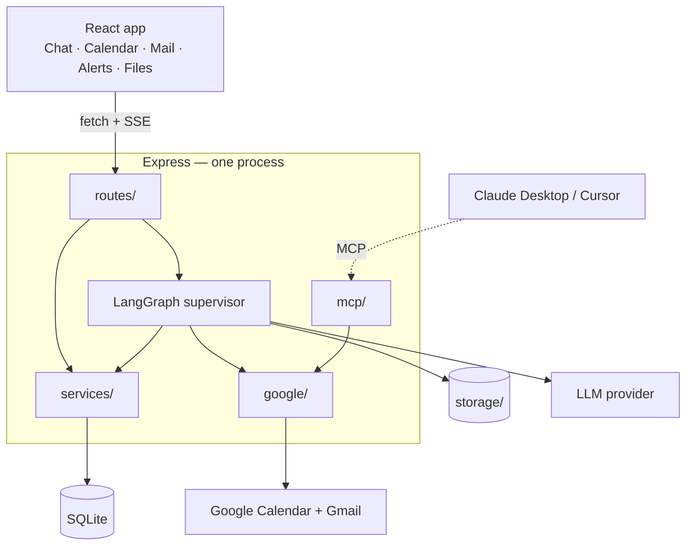

# CortexOne

One multi-agent assistant that chats, searches the web, writes code, generates
PDFs and slide decks, reads images and documents — and works with your real
Google Calendar and Gmail.

TypeScript end to end. LangChain + LangGraph for the agents. MCP so other tools
can use the same capabilities.

```
┌─────────────────────────────────────────────────────────────┐
│  "Find the thread about the launch, book 30 minutes with    │
│   everyone on it, and remind me an hour before."            │
└─────────────────────────────────────────────────────────────┘
                              ↓
        router → workspace agent → search_mail
                                 → find_free_slot
                                 → create_meeting
                                 → create_reminder
                              ↓
        "Booked 'Launch sync' Thu 14:00–14:30 with 4 people.
         Meet link added, reminder set for 13:00."
```

---

## What it does

| | |
|---|---|
| 💬 **Chat** | General conversation with conversation memory |
| 📅 **Calendar** | List, create, reschedule, cancel; check availability; find free slots |
| 📧 **Mail** | Search with Gmail syntax, read, send, reply in-thread, mark read |
| 🔔 **Notifications** | Meeting reminders and mail nudges, pushed live, no polling |
| 🔍 **Web search** | Fresh information with inline citations |
| 📄 **PDF generation** | A structured, multi-section document, downloadable |
| 📊 **Slide decks** | A themed 9-slide `.pptx` with three layouts |
| 🖼️ **Image generation** | Prompt-enhanced, stored locally |
| 👁️ **Vision** | Upload an image: describe it, extract text, explain charts |
| 📑 **Document Q&A** | Upload a PDF and ask questions, answered only from the document |
| 💻 **Code** | Build projects as artifacts with a live preview, or review existing code |
| 🔌 **MCP** | The same calendar and mail tools in Claude Desktop or Cursor |

---

## Quick start

```bash
npm install
cp .env.example server/.env        # then fill it in — see docs/05-SETUP.md
cp web/.env.example web/.env
npm run db:push
npm run dev
```

Open <http://localhost:5173>.

You need **two things** in `server/.env`: a Google OAuth client (sign-in +
Calendar + Gmail in one consent) and one LLM API key. Full walkthrough in
[docs/05-SETUP.md](docs/05-SETUP.md).

---

## Stack

| Layer | Choice | Why |
|---|---|---|
| Language | TypeScript, both ends | one language, one mental model |
| Agents | LangChain + LangGraph (JS) | explicit graph, inspectable state |
| Backend | Node + Express 5 | one process, no gateway |
| Database | SQLite + Prisma | zero install; one line to switch to Postgres |
| Auth | Google OAuth 2.0 + JWT cookie | one consent does sign-in *and* data access |
| Frontend | React 19 + Vite + Tailwind v4 | fast, no SSR needed |
| State | Zustand | three small stores, no boilerplate |
| Streaming | Server-Sent Events | one-directional, rides on plain HTTP |
| Interop | Model Context Protocol | stdio + Streamable HTTP |

**No Docker, no Redis, no MongoDB, no vector database, no S3, no cloud account**
beyond the API keys.

---

## The architecture in one picture



A **router** node picks one of nine agents. Eight answer in one pass. The ninth,
`workspace`, is a ReAct loop with 16 calendar, mail and notification tools, and
it is what makes multi-step requests work.

---

## Documentation

| | |
|---|---|
| [01 — Architecture](docs/01-ARCHITECTURE.md) | the design and every trade-off, with diagrams |
| [02 — File guide](docs/02-FILE-GUIDE.md) | all 66 files, what each does and why |
| [03 — Build order](docs/03-BUILD-ORDER.md) | 12 stages, each ending in something runnable |
| [04 — Data flows](docs/04-DATA-FLOWS.md) | six requests traced end to end |
| [05 — Setup](docs/05-SETUP.md) | Google Cloud, keys, MCP, troubleshooting |

**New here?** Read [01](docs/01-ARCHITECTURE.md), then open
[`server/src/ai/graph.ts`](server/src/ai/graph.ts) — it is 130 lines and the
whole agent system fits in your head from there.

**Typing it out yourself?** Follow [03](docs/03-BUILD-ORDER.md) top to bottom.

---

## Layout

```
cortex-one/
├── docs/                  five guides
├── server/
│   ├── prisma/            schema.prisma — 7 models
│   └── src/
│       ├── lib/           errors · SSE · storage · time
│       ├── auth/          OAuth · sessions · the gate
│       ├── google/        calendar.ts · gmail.ts  (framework-free)
│       ├── ai/            graph · router · state · models · vector store
│       │   ├── agents/    9 agents
│       │   └── tools/     16 tools in 3 files
│       ├── generators/    pdf · pptx
│       ├── services/      conversations · credits · limits · alerts · cron
│       ├── routes/        7 route files
│       └── mcp/           tools · http · stdio
└── web/src/
    ├── lib/               api · sse · types
    ├── store/             auth · chat · notifications
    ├── components/        layout · markdown · chat/
    └── pages/             Login · Chat · Calendar · Mail · Alerts · Files
```

---

## A few decisions worth knowing

**One Google consent, not two auth systems.** Signing in *is* the calendar and
mail grant. There is no second "connect your calendar" step.

**Charge before the work, refund if it throws.** `runBilled()` wraps every agent:
rate limit → charge → run → refund on failure. Charging afterwards lets an empty
wallet burn paid API calls.

**One implementation, three front doors.** `google/calendar.ts` and
`google/gmail.ts` have no framework types, so the agent tools, the REST routes
and the MCP server all share them. Browsing your inbox costs nothing; asking the
agent to act costs a model call.

**The model never names a user.** `userId` is closed over when tools are built,
never passed as a tool argument.

**Tagged text, not JSON, for structured generation.** Model JSON fails a dozen
ways and each failure wastes a paid call. A line format degrades: skip the bad
line, render the rest.

**Preferences are the long-term memory.** Say *"I'm in IST, default my meetings
to 45 minutes"* once and every future conversation knows it.

---

## Credits

Each agent run costs from a per-user wallet (500 to start).

| Agent | Cost | | Agent | Cost |
|---|---|---|---|---|
| chat | 1 | | pdf | 10 |
| workspace | 3 | | ppt | 10 |
| search | 5 | | image | 10 |
| docqa | 5 | | vision | 10 |
| coding | 10 | | | |

Rate limits are per user, per agent, per minute — 20 for chat down to 3 for
image. `grantCredits()` in `services/credits.service.ts` is where a payment
provider would hook in.

---

## Built from

Two earlier projects merged into one:

- **cortex-ai** — the LangGraph supervisor, the eight content agents, credits and artifacts
- **agentic-calendar-assistant** — Google Calendar tools, MCP, SSE streaming, working memory

Plus Gmail and notifications, which neither had. Along the way the two auth
vendors, five microservices, Redis, MongoDB, Qdrant and S3 became one process,
one database and one folder. See
[01-ARCHITECTURE §1.3](docs/01-ARCHITECTURE.md#13-what-was-removed-and-what-replaced-it).
