# 1. Architecture

How CortexOne is put together, and why each decision was made.

---

## 1.1 What this project is

Two earlier projects, merged:

| Project | What it had | What survived |
|---|---|---|
| **cortex-ai** | LangGraph supervisor, 8 agents (chat, search, coding, pdf, ppt, image, vision, pdf-RAG), credits, rate limits, artifacts | The whole agent system, redesigned in TypeScript |
| **agentic-calendar-assistant** | Google Calendar tools, an MCP server, streaming chat, working memory | Calendar, MCP, SSE streaming, durable preferences |

Plus what neither had: **Gmail** and **notifications**.

## 1.2 The shape of it

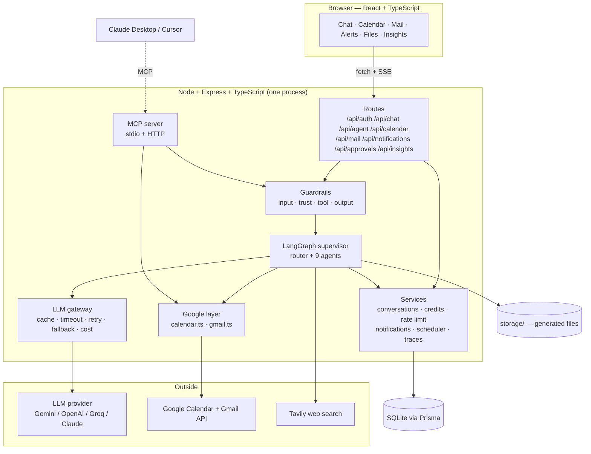

**One process.** The original cortex-ai ran five services behind a gateway (auth, chat, billing, agent, gateway) with Redis, MongoDB, Qdrant and S3 behind them. That is a sensible shape for a team deploying independently; it is a bad shape for one person trying to understand a system. Everything here is one Express app, one database and one folder of files.

## 1.3 What was removed, and what replaced it

| Original | Replaced by | Why |
|---|---|---|
| Firebase auth + Descope | Google OAuth 2.0 directly | One consent screen grants sign-in *and* Calendar *and* Gmail. Two auth vendors became zero. |
| Redis sessions | Signed JWT in an httpOnly cookie | No server to run. The token carries the user id; the secret verifies it. |
| Redis chat cache | Nothing | SQLite on the same machine is already sub-millisecond. The cache was pure complexity. |
| Redis rate limiting | In-memory `Map` | Single process, so a shared store buys nothing. Swap for Redis if you ever run replicas. |
| MongoDB + Mongoose | SQLite + Prisma | Zero install, typed queries, one `schema.prisma` to read. |
| Qdrant vector DB | `ai/vector-store.ts`, ~100 lines | A document you throw away after one question does not need a database. |
| AWS S3 + presigned URLs | `storage/` on disk + `/api/files/:id` | No AWS account, and links in old transcripts never expire. |
| Razorpay billing | Credit wallet only | The wallet mechanics are the interesting part; payments need a merchant account. `grantCredits()` is the hook if you add one. |
| Nothing (new) | Four-layer guardrails | The agent reads attacker-controlled email. See [06-GUARDRAILS](06-GUARDRAILS.md). |
| Nothing (new) | LLM gateway | Retry, timeout, fallback, cache and cost accounting in one place. |
| Nothing (new) | Eval harness | 44 offline cases that run with no API key. See [07-EVALS](07-EVALS.md). |
| Mastra agent framework | LangGraph `createReactAgent` | One agent framework instead of two. |
| Next.js frontend | Vite + React | No SSR needed for an authenticated single-page app; Vite starts in under a second. |

## 1.4 The agent graph

This is the core. One router decides; one agent runs.

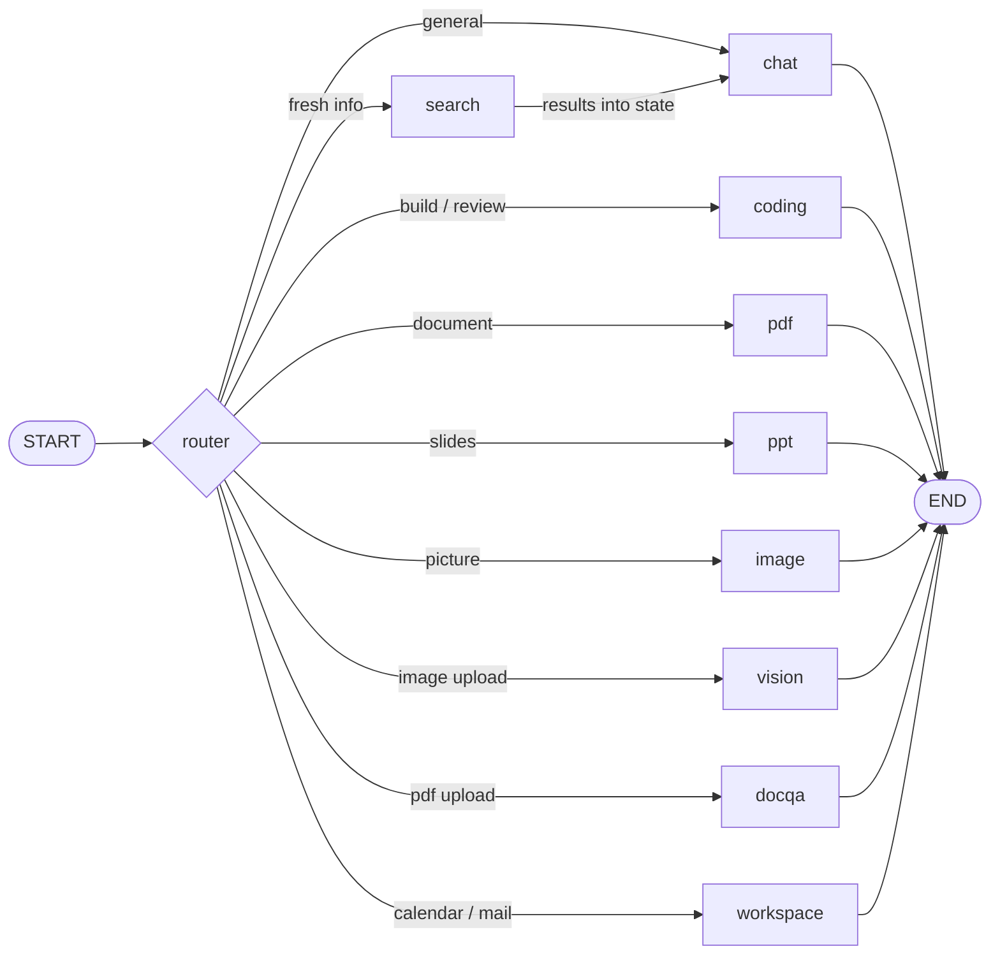

**One special edge.** `search` does not finish the turn. It fetches results, writes them into state, and hands off to `chat`, which writes the cited answer. That keeps citation style in one place and makes the search provider swappable.

### How the router decides — three stages, cheapest first

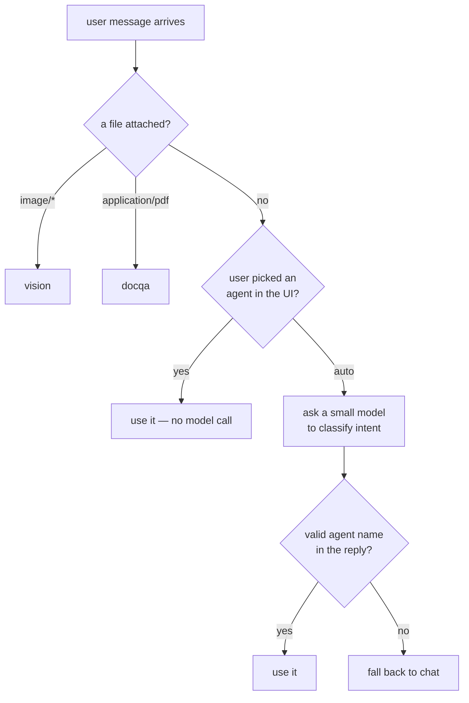

Stage 3 is the only one that costs a token, which is why it is last. `vision` and `docqa` are deliberately **not** offered to the classifier: they need a file, and the model picking them from text alone would route to an agent with nothing to read.

See [`server/src/ai/router.node.ts`](../server/src/ai/router.node.ts).

### The state that flows through

Every node reads this object and returns a **partial** update to it. Default reducer is last-value-wins, so returning `{ response: "..." }` leaves everything else untouched.

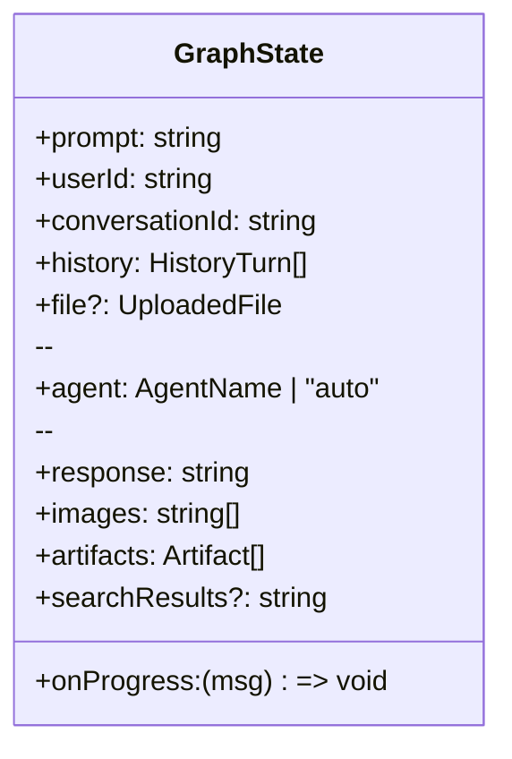

`searchResults` is `string | undefined` on purpose:

- `undefined` → no search happened
- `""` → search ran and failed
- text → search ran and worked

The chat agent words its answer differently in each case.

See [`server/src/ai/state.ts`](../server/src/ai/state.ts).

## 1.5 Two kinds of agent

Most agents are **one-shot**: call the model once, format the result, done.

```
prompt → model → parse → render → response
```

The `workspace` agent is a **ReAct loop**: the model picks a tool, sees the result, decides what to do next, and repeats until it can answer.

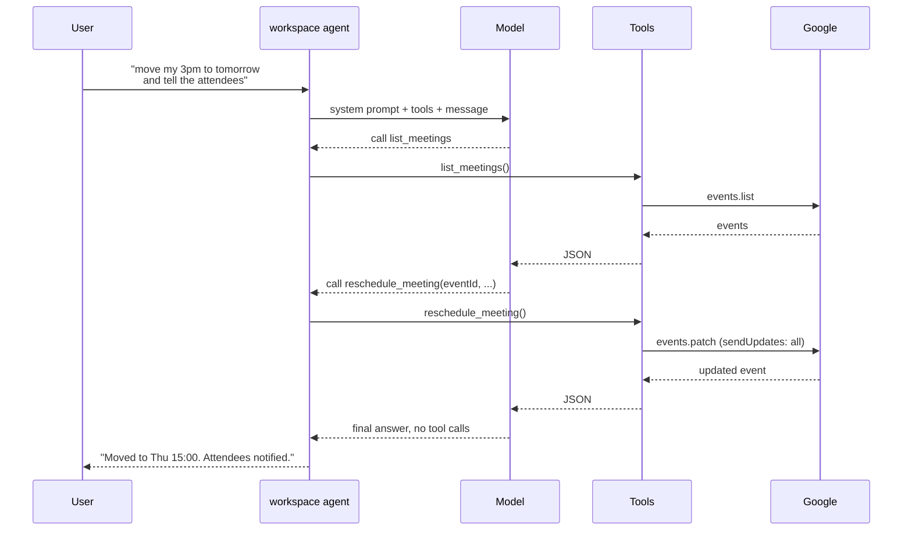

The loop ends when the model returns a message with **no tool calls**. That message is the answer.

`recursionLimit: 24` caps it so a confused model cannot burn the user's quota in a loop.

See [`server/src/ai/agents/workspace.agent.ts`](../server/src/ai/agents/workspace.agent.ts).

## 1.6 The toolbelt

Calendar, Mail and Notification tools are bound together into **one** agent rather than split across three. Real requests cross all three:

> "Find the thread about the launch, book 30 minutes with everyone on it, and remind me an hour before."

An agent that can only see one of them has to hand work back to the user.

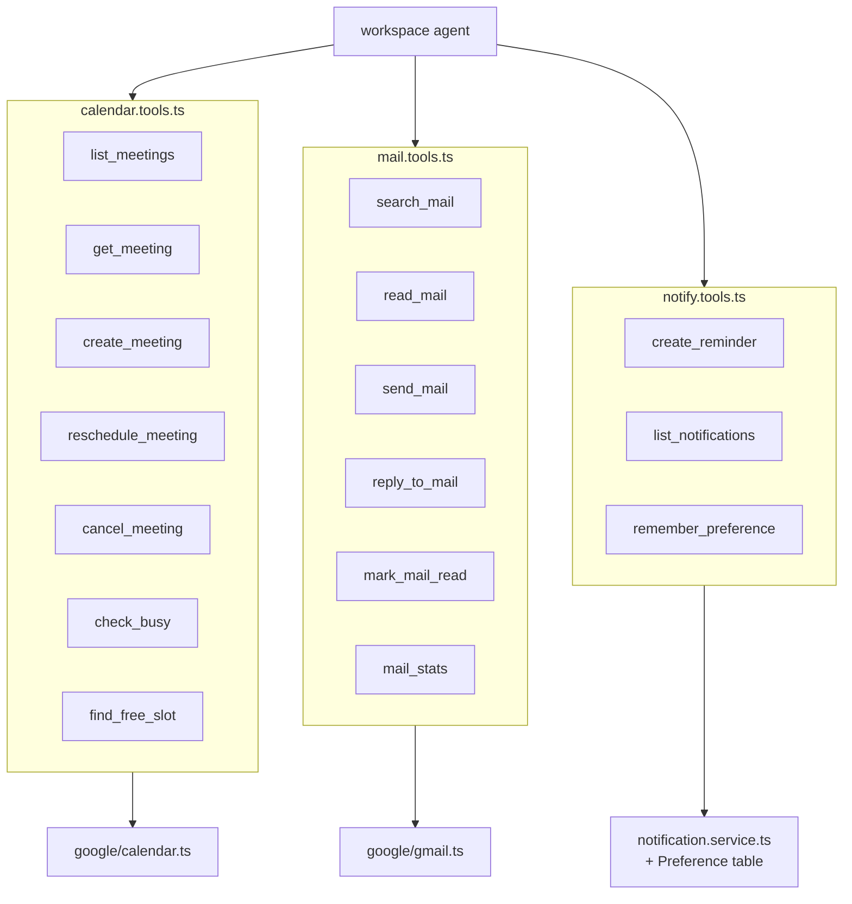

**`userId` is closed over, never a tool argument.** A model must never be in a position to name whose calendar to read.

## 1.7 Three front doors, one implementation

`google/calendar.ts` and `google/gmail.ts` are plain functions with no framework types. That is what lets three different callers share them:

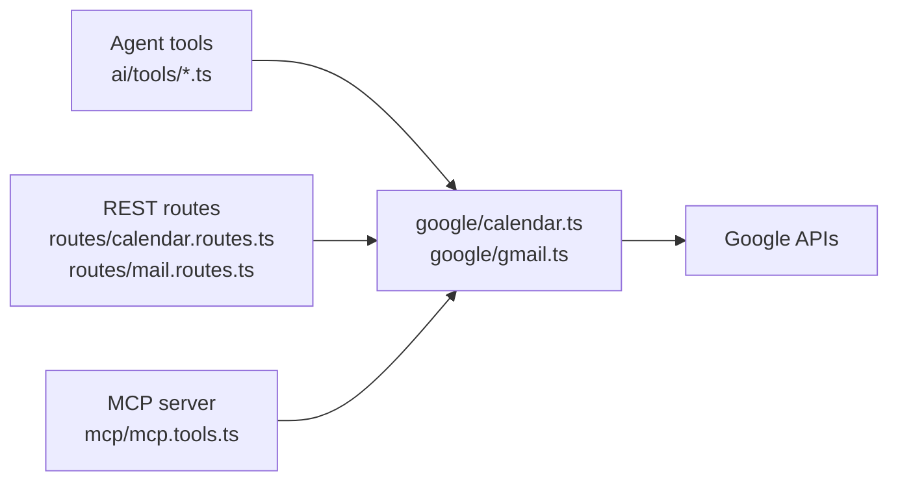

| Caller | Used by | Costs an LLM call? |
|---|---|---|
| Agent tools | the chat box | yes |
| REST routes | the Calendar and Mail pages | no |
| MCP server | Claude Desktop, Cursor | their own |

Browsing your inbox should be instant and free. Asking "move my 3pm and tell everyone" is worth a model call. Both paths hit the same code.

## 1.8 Memory: three layers

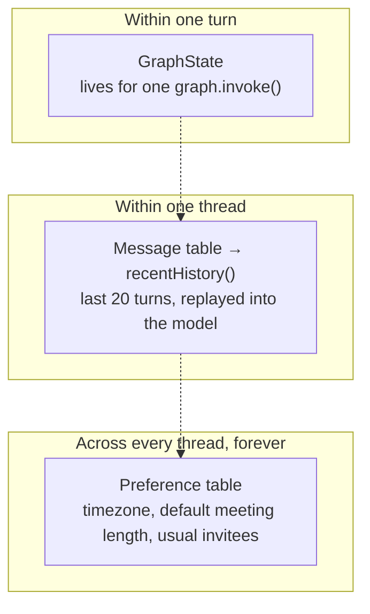

Layer 3 is what makes the assistant feel like it knows you. When the user says *"I'm in IST"*, the workspace agent calls `remember_preference`, and every future conversation gets it injected into the system prompt.

Preferences are injected as **text**, not fetched by a tool: they are small, needed almost every run, and a tool call would be a wasted round trip every time.

## 1.9 Billing and limits

The rule that matters: **charge before the work, refund if it throws.**

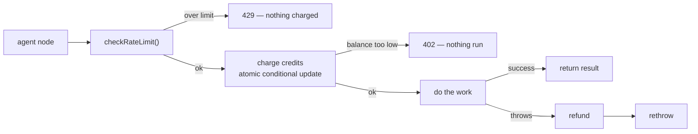

Charging afterwards would let a user with an empty wallet burn paid LLM and image-generation calls and only find out at the end.

The charge is a single atomic statement:

```ts
prisma.user.updateMany({
  where: { id: userId, credits: { gte: cost } },   // the check
  data:  { credits: { decrement: cost } },          // the decrement
});
```

`count === 0` means the balance was too low. A read-then-write would let two parallel requests both pass the check and push the balance negative.

See [`server/src/services/credits.service.ts`](../server/src/services/credits.service.ts).

## 1.10 Streaming

Both long-lived endpoints use **Server-Sent Events**, not WebSockets. Traffic is one-directional and rides on a plain HTTP response, so there is no second server to run.

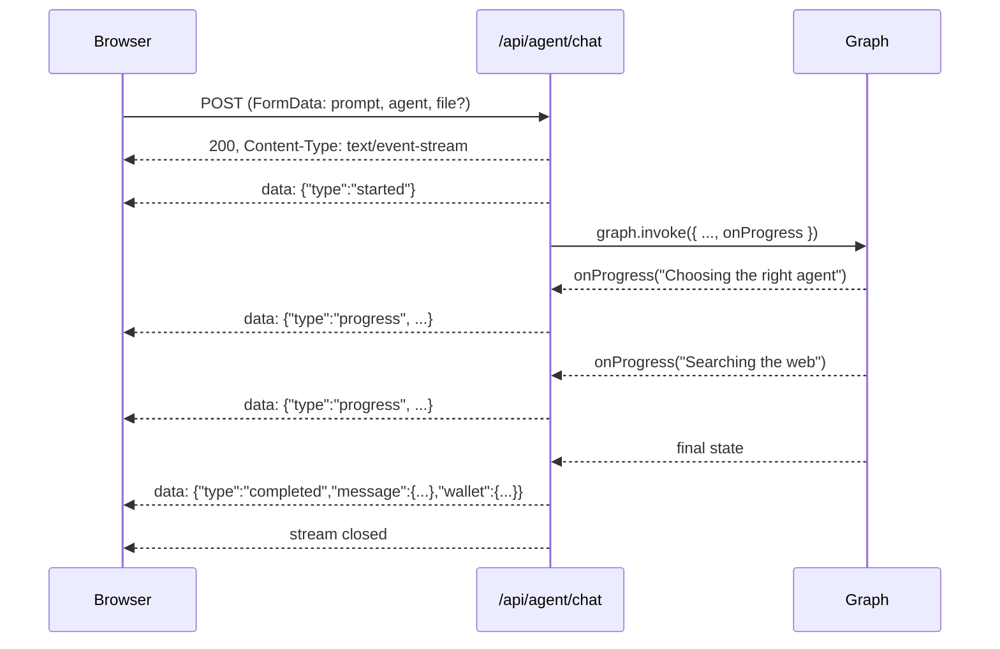

The browser's built-in `EventSource` can only do GET with no body, which rules it out — sending a message needs POST, often with a file. So `web/src/lib/sse.ts` reads the response body as a stream and parses the framing by hand.

**The one thing to get right:** a network chunk does not line up with an event boundary. Anything after the last blank line is kept in a buffer and completed by the next chunk.

## 1.11 Notifications

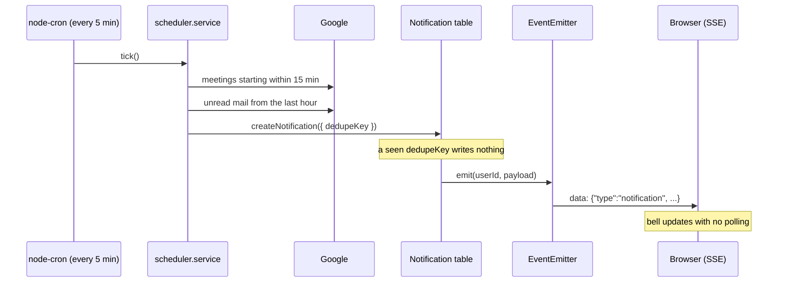

`dedupeKey` is what makes it safe to run the sweep every five minutes. `meeting:<eventId>` is written once; later ticks that see the same meeting are no-ops.

## 1.12 Security

| Concern | How it is handled |
|---|---|
| Session theft | httpOnly cookie — unreadable from JavaScript; `secure` in production |
| CSRF on OAuth | random `state` minted before the redirect, required back unchanged |
| Cross-user data | every query is scoped by `userId`; conversations answer **404**, not 403, so ids do not leak |
| Model naming another user | `userId` is closed over in tool factories, never a tool argument |
| Generated code running loose | artifact preview iframe is `sandbox="allow-scripts"` **without** `allow-same-origin` |
| Credential leaks in errors | `toErrorBody()` only echoes messages from `AppError`, which the app itself creates |
| Upload abuse | 20 MB cap, PDF and images only, deleted in a `finally` block |
| Quota abuse | per-user per-agent rate limit, then the credit wallet |

## 1.13 Guardrails: four layers, one of them hard

The agent reads the user's email, which means **anyone on the internet can put
text into its context**. That single fact shapes the safety design.

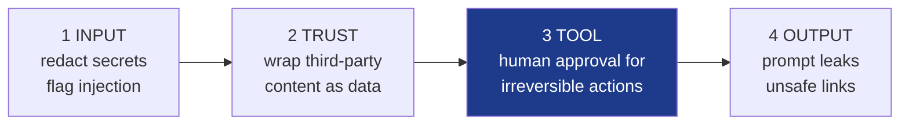

Layers 1, 2 and 4 are text analysis and can be talked around. **Layer 3 cannot**:
`send_mail`, `reply_to_mail` and `cancel_meeting` write a `PendingAction` row
instead of acting, and a human approves it. The server then executes the stored
arguments with **no model involved**, so what runs is exactly what the user read.

MCP gets the same gate — otherwise it would be a hole straight through the policy.

Full detail in [06-GUARDRAILS.md](06-GUARDRAILS.md).

## 1.14 The LLM gateway

Every model call goes through `invokeModel()` in
[`ai/gateway.ts`](../server/src/ai/gateway.ts) rather than `model.invoke()`:

| | |
|---|---|
| **cache** | temperature-0 roles only (the router) |
| **timeout** | a hung provider cannot hold a request open |
| **retry** | transient errors only, exponential backoff with jitter |
| **fallback** | a second provider when the first keeps failing |
| **accounting** | tokens and cost into a per-run `UsageMeter` |

`LLM_PROVIDER=openrouter` uses a hosted gateway instead; the in-process one still
applies on top.

## 1.15 Observability

One `Trace` row per run — agent, latency, tokens, cost, guardrail flags — and an
**Insights** page that answers three questions an agent app cannot answer by
default: what is this costing, which agent is slow, and which guardrails are
actually firing.

A guardrail nobody can see is a guardrail nobody will maintain.

## 1.16 Where to go next

- [02-FILE-GUIDE.md](02-FILE-GUIDE.md) — what every file does
- [03-BUILD-ORDER.md](03-BUILD-ORDER.md) — the order to write them in
- [04-DATA-FLOWS.md](04-DATA-FLOWS.md) — six requests traced end to end
- [05-SETUP.md](05-SETUP.md) — keys, OAuth and running it
- [06-GUARDRAILS.md](06-GUARDRAILS.md) — the four layers, and the attack that shapes them
- [07-EVALS.md](07-EVALS.md) — the eval harness, the gateway and observability
