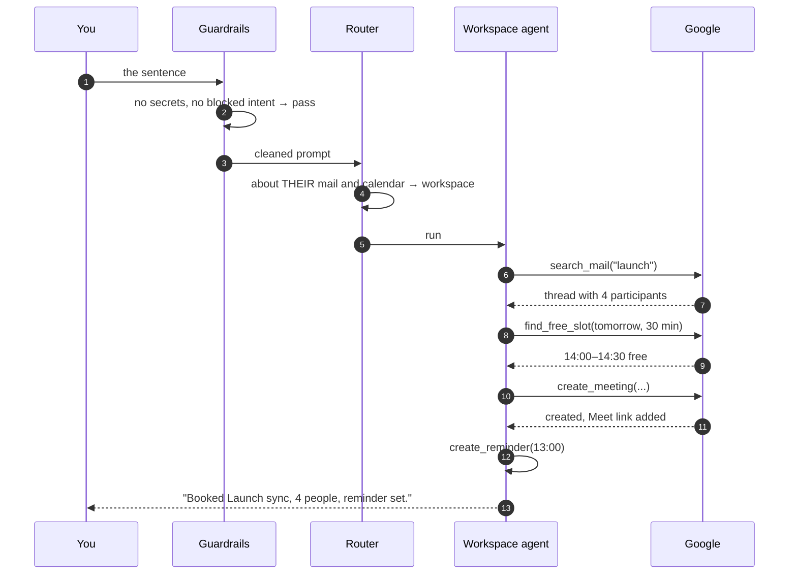
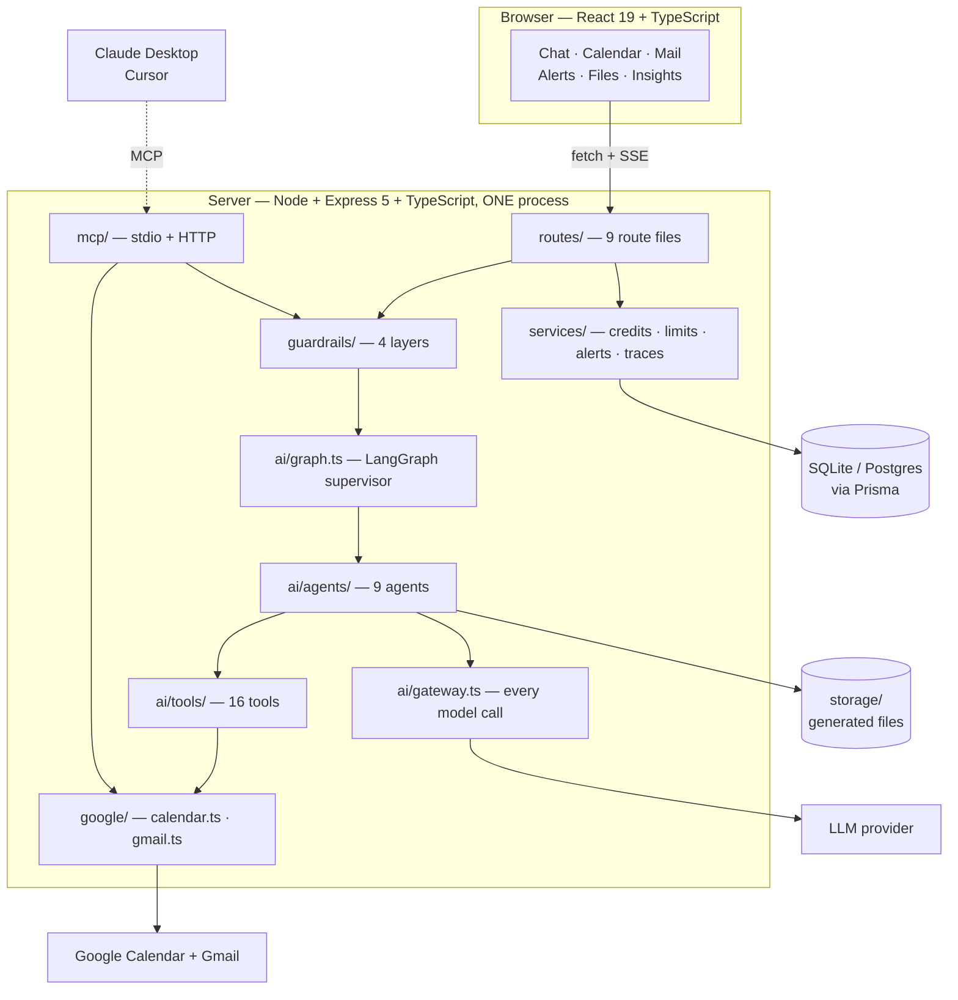
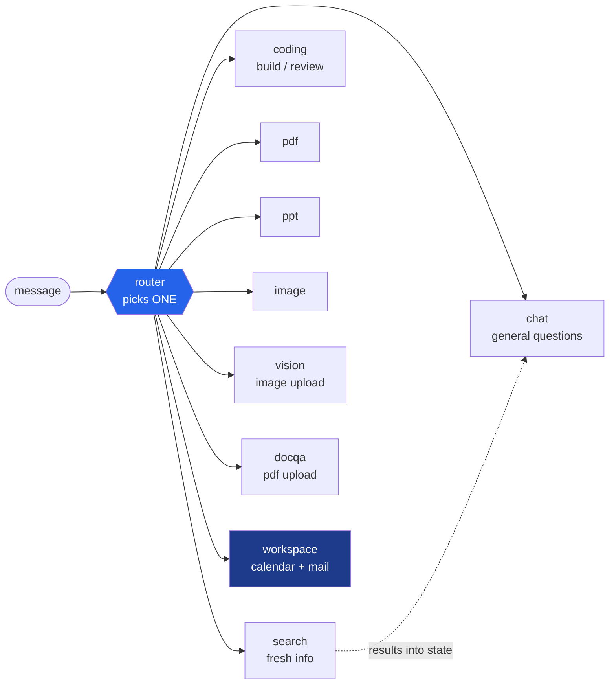
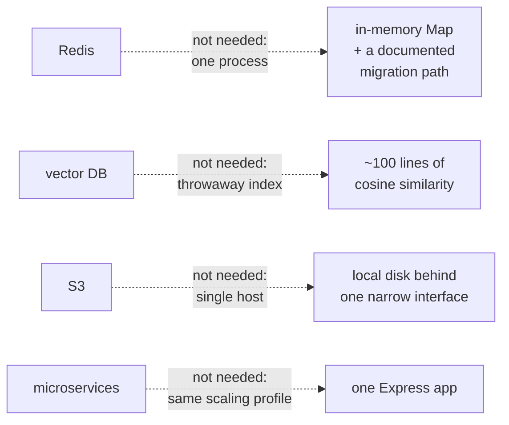

# 1. Overview

What AI Secretary is, what it does, and how the pieces fit. Read this first; by the
end you should be able to picture the whole system.

---

## 1.1 What it is, in one sentence

**A chat interface where a language model can actually do things** — read your
calendar, search your inbox, book meetings, send email, generate documents — with
a safety layer that stops it doing the irreversible ones without your say-so.

The interesting part is not the chat. It is everything between "the user typed a
sentence" and "a meeting exists in Google Calendar."

---

## 1.2 What a turn actually looks like

```
You:  "Find the thread about the launch, book 30 minutes with everyone
       on it tomorrow, and remind me an hour before."
```



Four tool calls, one model deciding between each, and you typed one sentence.
That loop is called **ReAct**, and [02-CONCEPTS §2.6](02-CONCEPTS.md) explains
exactly how it works.

Now a different request:

```
You:  "Reply to Sam and say Friday works."
```

```
Assistant:  I'll send this reply to sam@acme.com:

            > Friday works for me. See you then.

            ┌─────────────────────────────────────────────┐
            │ ⚠ Needs your approval                       │
            │ Reply in thread 18f2a9c…                    │
            │                                             │
            │ Reply: Friday works for me. See you then.   │
            │                                             │
            │ [Approve and run]  [Discard]                │
            │ Nothing has been sent yet                   │
            └─────────────────────────────────────────────┘
```

**Nothing was sent.** The agent wrote a proposal; you decide. That is the single
most important design decision in the project, and
[06-GUARDRAILS](06-GUARDRAILS.md) explains why.

---

## 1.3 The twelve things it does

| | Feature | Agent |
|---|---|---|
| 💬 | Chat with memory of the conversation | `chat` |
| 📅 | List, create, move, cancel meetings; find free time | `workspace` |
| 📧 | Search, read, send, reply to email | `workspace` |
| 🔔 | Meeting reminders and mail nudges, pushed live | `workspace` + cron |
| 🔍 | Web search with inline citations | `search` → `chat` |
| 📄 | Generate a multi-section PDF | `pdf` |
| 📊 | Generate a themed 9-slide `.pptx` | `ppt` |
| 🖼️ | Generate an image | `image` |
| 👁️ | Read an uploaded image: describe, transcribe, explain charts | `vision` |
| 📑 | Ask questions about an uploaded PDF | `docqa` |
| 💻 | Build a code project with a live preview, or review code | `coding` |
| 🔌 | The same calendar and mail tools inside Claude Desktop or Cursor | MCP |

---

## 1.4 The system in one picture



**One process.** No microservices, no Redis, no Kafka, no vector database. That is
a deliberate choice, explained in [03-ARCHITECTURE §3.3](03-ARCHITECTURE.md).

---

## 1.5 The nine agents and who picks them



Two things to notice:

1. **`search` does not finish the turn.** It fetches results into shared state and
   hands off to `chat`, which writes the cited answer. The only two-node path in
   the graph.
2. **`workspace` is different in kind.** The other eight call a model once and
   format the result. `workspace` is a loop that can call 16 tools in any order
   until it has an answer.

---

## 1.6 Tour the code in ten minutes

Open these seven files in order. This is genuinely the fastest way to understand
the project.

| # | File | Lines | What you learn |
|---|---|---|---|
| 1 | [`ai/state.ts`](../server/src/ai/state.ts) | 155 | the shared object every agent reads and writes |
| 2 | [`ai/graph.ts`](../server/src/ai/graph.ts) | 130 | the whole agent system: nodes, edges, routing |
| 3 | [`ai/router.node.ts`](../server/src/ai/router.node.ts) | 120 | how one agent gets chosen, cheapest check first |
| 4 | [`ai/tools/calendar.tools.ts`](../server/src/ai/tools/calendar.tools.ts) | 180 | what a "tool" actually is |
| 5 | [`ai/agents/workspace.agent.ts`](../server/src/ai/agents/workspace.agent.ts) | 165 | the ReAct loop, and the prompt that steers it |
| 6 | [`guardrails/tool.guard.ts`](../server/src/guardrails/tool.guard.ts) | 230 | propose-then-approve |
| 7 | [`routes/agent.routes.ts`](../server/src/routes/agent.routes.ts) | 240 | how an HTTP request becomes a graph run |

Every file opens with a comment explaining *why it exists*, not just what it does.

---

## 1.7 What is deliberately absent

A GenAI project of this shape usually accumulates infrastructure. This one does
not, and each absence is a decision rather than an oversight:



The point is not minimalism for its own sake. It is that **every component
should solve a problem the code actually has** — and that you should be able to
say precisely when each absence stops being the right answer.

[13-DECISIONS.md](13-DECISIONS.md) records each one with its trade-off and the
trigger that would change it.

---

## 1.8 What makes it defensible

If you are going to explain this to someone, these five points are the substance.

### 1. One implementation, three front doors

`google/calendar.ts` and `google/gmail.ts` contain **no framework types** — no
Express `Request`, no LangChain `tool()`. So the agent tools, the REST routes and
the MCP server all call the same functions.

Browsing your inbox on the Mail page costs nothing. Asking the agent to act costs
a model call. Same code underneath.

### 2. Charge before the work, refund if it throws

```ts
await checkRateLimit(userId, agent);
await charge(userId, agent);
try   { return await work(); }
catch { await refund(userId, agent); throw; }
```

Charging afterwards lets someone with an empty wallet burn paid API calls and only
find out at the end.

### 3. The model never names a user

`userId` is closed over when tools are constructed, never passed as a tool
argument. A model is structurally incapable of asking for someone else's calendar.

### 4. Tagged text, not JSON, for structured generation

Model JSON fails a dozen ways — trailing comma, smart quote, stray ` ```json `
fence — and every failure wastes a call you already paid for. A line format
degrades: skip the bad line, render the rest.

### 5. Writes need a human; reads do not

The agent reads attacker-controlled email, so a sufficiently clever email could
talk it into anything. The answer is not a better regex — it is that the
dangerous tools cannot act, only propose.

---

## 1.9 Honest limitations

| | |
|---|---|
| SQLite by default | fine for one process; the Docker image runs on Postgres with committed migrations ([10-DEPLOYMENT](10-DEPLOYMENT.md)) |
| In-memory rate limits | correct for one instance; needs Redis for several |
| Local file storage | survives restarts via a volume, but not multi-host without S3 |
| No token-level streaming | progress lines stream; the answer arrives whole |
| No per-session revocation | the trade for a signed cookie instead of a session store |
| Re-embeds on each doc question | a follow-up re-embeds the PDF; cache by file hash to fix |

Knowing the limits of your own design is most of what "senior" means.

---

## 1.10 Next

[**02-CONCEPTS**](02-CONCEPTS.md) teaches every concept the project uses — what a
tool call really is, how LangGraph state works, what MCP is, how RAG retrieves —
each one with the actual code from this repo.

<!-- nav -->

---

[← Documentation index](README.md) · [Index](README.md) · [Concepts →](02-CONCEPTS.md)
