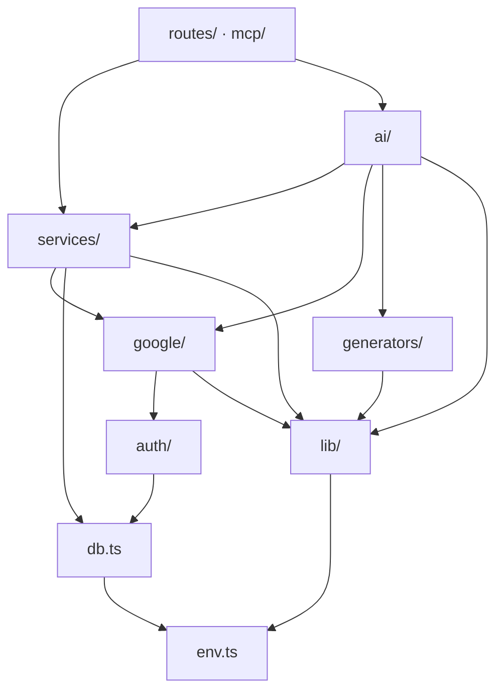

# 2. File guide

Every file, what it does, and what it depends on. Use this as a map while you write.

**Total: 66 source files** — 38 server, 23 web, 5 docs.

---

## 2.1 Folder shape

```
cortex-one/
├── package.json              npm workspaces + the dev script
├── .env.example              every key, commented
│
├── server/                   Node + Express + TypeScript
│   ├── prisma/schema.prisma  the data model
│   └── src/
│       ├── index.ts          process entry: listen + cron + shutdown
│       ├── app.ts            Express app: middleware + route table
│       ├── env.ts            all env vars, parsed once
│       ├── db.ts             the Prisma client singleton
│       ├── lib/              errors, SSE, storage, time
│       ├── auth/             Google OAuth, sessions, the auth gate
│       ├── google/           Calendar and Gmail, framework-free
│       ├── ai/               the graph, agents, tools, models
│       ├── generators/       PDF and PPTX rendering
│       ├── services/         conversations, credits, limits, alerts, cron
│       ├── routes/           the HTTP surface
│       └── mcp/              Model Context Protocol server
│
└── web/                      React + TypeScript + Vite
    └── src/
        ├── main.tsx          mount
        ├── App.tsx           routes + the auth gate
        ├── index.css         design tokens + Markdown styling
        ├── lib/              API client, SSE reader, types
        ├── store/            Zustand stores
        ├── components/       layout + chat pieces
        └── pages/            the five screens
```

---

## 2.2 Server — foundation

| File | What it does | Why it exists |
|---|---|---|
| **`env.ts`** | Reads and validates every environment variable once, exports a frozen `env` object | Nothing else touches `process.env`. A missing key fails loudly at boot, not as `undefined` halfway through an agent run. |
| **`db.ts`** | The Prisma client singleton | Cached on `globalThis` because `tsx watch` re-imports modules on save, and a fresh client per reload leaks connections until SQLite refuses to open another. |
| **`app.ts`** | Express app: CORS, JSON, cookies, the route table, the error handler | Separate from `index.ts` so a test can import the app without starting a listener or a cron job. |
| **`index.ts`** | `listen()`, start the scheduler, handle SIGINT/SIGTERM | Prints a startup banner showing what is and is not configured. Half of all "why isn't this working" time goes on a missing key. |
| **`prisma/schema.prisma`** | 7 models: User, GoogleAccount, Preference, Conversation, Message, Notification, StoredFile | Switch `provider` to `postgresql` and nothing else changes. |

### `lib/`

| File | What it does | The detail worth knowing |
|---|---|---|
| **`errors.ts`** | `AppError` + `toErrorBody()` + `statusOf()` | Only `AppError` messages reach the browser. Anything else becomes a generic 500, so internal details never leak into a chat bubble. |
| **`sse.ts`** | `openSseStream(res)` → `{ send, comment, close }` | A heartbeat comment every 25s keeps proxies from dropping an idle connection. `X-Accel-Buffering: no` stops nginx buffering the whole stream into one chunk at the end. |
| **`storage.ts`** | `saveBuffer()`, `resolveOwnedFile()`, `publicUrl()` | Deliberately narrow interface — swapping in S3 means rewriting this one file. |
| **`time.ts`** | `startOfToday()`, `humanTime()`, `parseJsonArray()` | One answer to "what counts as today", shared by the calendar tools, the cron and the prompts. |

### `auth/`

| File | What it does | The detail worth knowing |
|---|---|---|
| **`google-oauth.ts`** | Scope list, consent URL, code exchange, user upsert | `access_type: "offline"` + `prompt: "consent"` is what makes Google return a **refresh token**. Without it you get an access token that dies in an hour and the agent silently stops working. |
| **`session.ts`** | Sign / verify / clear the JWT cookie | 7-day expiry. A signed cookie cannot be revoked early, which is the trade for not running Redis. |
| **`require-auth.ts`** | The gate: verify cookie → load user → `req.user` | Loads the **row**, not just the token, so credit changes take effect immediately and a deleted account cannot keep using an old cookie. |

### `google/`

| File | What it does | The detail worth knowing |
|---|---|---|
| **`client.ts`** | Hands out authenticated `calendar` / `gmail` clients | The `tokens` listener catches a refreshed access token and writes it back, so token refresh lives in exactly one place. |
| **`calendar.ts`** | `listMeetings`, `getMeeting`, `createMeeting`, `rescheduleMeeting`, `cancelMeeting`, `checkBusy`, `findFreeSlot` | `singleEvents: true` expands a recurring event into occurrences, which is what "my next three meetings" should mean. `conferenceDataVersion: 1` is required for Google to actually mint the Meet link. |
| **`gmail.ts`** | `listMail`, `readMail`, `sendMail`, `replyToMail`, `markMailRead`, `mailStats` | Bodies arrive base64url-encoded in a nested MIME tree, so `extractBody` walks it: prefers `text/plain`, falls back to `text/html` with tags stripped. Replying needs `threadId` **plus** `In-Reply-To`, or Gmail shows it as a new conversation. |

---

## 2.3 Server — the AI layer

| File | What it does | The detail worth knowing |
|---|---|---|
| **`ai/models.ts`** | `getModel(role)` + `getEmbeddings()` | Agents ask by **role** (`"router"`, `"vision"`), never by provider. Temperature is 0 where output is parsed by code, warmer where it is prose for a human. Models are cached per role. |
| **`ai/state.ts`** | The `GraphState` annotation | Read this first when you want to understand the graph. Every node reads it and returns a partial update. |
| **`ai/router.node.ts`** | Picks one agent | Three stages, cheapest first — see [01-ARCHITECTURE §1.4](01-ARCHITECTURE.md#how-the-router-decides--three-stages-cheapest-first). Parses the first valid word from the reply, because models answer `"Search."` and `"agent: coding"` often enough that a bare match is unsafe. |
| **`ai/graph.ts`** | Wires nodes and edges, compiles once | Compilation validates the wiring, so a typo in a destination fails at boot rather than mid-conversation. Also exports `AGENT_CATALOG`, which the UI picker reads — the list can never drift from the graph. |
| **`ai/vector-store.ts`** | ~100-line cosine-similarity vector store | LangChain v1 dropped `MemoryVectorStore`, and running Qdrant for one throwaway document is operations work for nothing. This is also the clearest possible explanation of what retrieval actually is. |

### `ai/tools/`

| File | Tools | The detail worth knowing |
|---|---|---|
| **`calendar.tools.ts`** | 7 calendar tools | Thin wrappers. What they add is the **schema and the description** — that is the real prompt engineering, since the model only ever sees name + description + schema. |
| **`mail.tools.ts`** | 6 Gmail tools | `search_mail`'s description teaches the model Gmail query syntax, turning "any unread from Sam this week?" into one tool call instead of a listing the model then filters in its head. |
| **`notify.tools.ts`** | `create_reminder`, `list_notifications`, `remember_preference` | `remember_preference` is the long-term memory. Also exports `loadPreferences()`, used to build the workspace system prompt. |
| **`index.ts`** | `createWorkspaceTools(userId)` | Binds all three sets together. |

### `ai/agents/`

| File | Pattern | The detail worth knowing |
|---|---|---|
| **`workspace.agent.ts`** | **ReAct loop** | The heart of "chat with your calendar". Checks the Google grant *before* billing so a missing connection gives a clear message rather than a tool error deep in the loop. |
| **`chat.agent.ts`** | one-shot | Two entry paths: direct (charges for `chat`) or via search (does **not** charge again — the search node already billed). |
| **`search.agent.ts`** | one-shot, no prose | Fetch and format only. Numbers results `[1] [2]` so the chat prompt's citation instruction lines up. Degrades to empty results if there is no API key. |
| **`coding.agent.ts`** | one-shot | Emits either `FILE:` blocks (→ an artifact with tabs and a live preview) or Markdown (→ a review). The model signals which by whether it emits file blocks — simpler than a separate intent field to parse. |
| **`pdf.agent.ts`** | one-shot | Asks for **tagged plain text**, not JSON. JSON from a model fails a dozen ways and each failure throws away a paid call; a line format degrades instead — an unparsable line is skipped and the rest renders. |
| **`ppt.agent.ts`** | one-shot | Same tagged format, plus slide **types** (`bullets` / `stats` / `conclusion`) mapping to layout functions. |
| **`image.agent.ts`** | two-step | A text model first rewrites the request into a detailed image prompt. Bytes are downloaded and stored locally so the picture survives in the transcript. 90s abort timeout — the provider can hang. |
| **`vision.agent.ts`** | one-shot | Image passed inline as a base64 data URL. Checks `providerSupportsVision()` first for a clear message. |
| **`docqa.agent.ts`** | RAG pipeline | extract → split → embed → similarity search → grounded answer. Extraction happens **before** billing: a scanned PDF with no text layer should cost nothing. |

### `generators/`

| File | What it does | The detail worth knowing |
|---|---|---|
| **`pdf.generator.ts`** | `renderPdf(spec)` → Buffer | Kept apart from the agent so the layout is testable with a hand-written outline, no model needed. `bufferPages: true` is what allows stamping page numbers once the total is known. |
| **`ppt.generator.ts`** | `renderDeck(spec)` → Buffer | Four layout functions on a 13.33 × 7.5 inch canvas. The file opens with a documented cast: pptxgenjs's `export as namespace` makes TypeScript resolve the default export to the module object rather than the class. |

---

## 2.4 Server — services and routes

### `services/`

| File | What it does | The detail worth knowing |
|---|---|---|
| **`credits.service.ts`** | `runBilled(userId, agent, work)` | The wrapper every agent runs inside: rate limit → charge → run → refund on throw. One place, so no individual agent has to remember the ordering. |
| **`ratelimit.service.ts`** | Fixed-window counter per user per agent | In-memory `Map` with a sweep interval, `unref`'d so it does not hold the event loop open. |
| **`conversation.service.ts`** | Conversation CRUD + `recentHistory()` + `autoTitle()` | `assertOwned()` guards every function and answers **404**, never 403. |
| **`notification.service.ts`** | DB write + `EventEmitter` fan-out | `dedupeKey` turns a repeat into a no-op, which is what makes a 5-minute sweep safe. |
| **`scheduler.service.ts`** | The `node-cron` sweep | One user's expired grant must not stop the sweep for everyone else, so each call is individually caught. |

### `routes/`

| File | Endpoints | Needs an LLM? |
|---|---|---|
| **`auth.routes.ts`** | `/google`, `/google/callback`, `/logout`, `/me`, `/google/disconnect` | no |
| **`agent.routes.ts`** | `POST /chat` (SSE), `GET /catalog` | **yes** |
| **`chat.routes.ts`** | conversation CRUD + transcripts | no |
| **`calendar.routes.ts`** | meetings CRUD, `/busy`, `/free-slot` | no |
| **`mail.routes.ts`** | messages, read, send, reply, stats | no |
| **`notification.routes.ts`** | list, mark read, clear, sweep, `GET /stream` (SSE) | no |
| **`file.routes.ts`** | list + download generated files | no |

`agent.routes.ts` is the one worth reading closely. Order of operations matters:

1. load history **before** saving the new message, or the prompt appears twice in the model's context
2. open the SSE stream **before** invoking the graph, so progress events can be sent while it runs
3. delete the upload in `finally`, whichever agent ran and however it ended

### `mcp/`

| File | What it does |
|---|---|
| **`mcp.tools.ts`** | Registers 10 tools on an `McpServer`, reusing `google/`. MCP handlers return a `content` array of typed blocks, not a bare string — the one shape difference from the LangChain tools. |
| **`http.ts`** | `POST /mcp` over Streamable HTTP. Stateless: a fresh server per request, so a restart never strands a client. |
| **`stdio.ts`** | `npm run mcp` for Claude Desktop / Cursor. **stdout is the protocol channel**, so every log here goes to stderr. |

---

## 2.5 Web

| File | What it does | The detail worth knowing |
|---|---|---|
| **`lib/types.ts`** | Every API shape | Mirrors the server by hand. A shared package would remove the duplication but add a build step to a project whose point is being easy to follow. |
| **`lib/api.ts`** | The single HTTP client | `credentials: "include"` on every call, or the cookie is not sent and everything 401s. Unwraps error bodies into thrown `ApiError`. |
| **`lib/sse.ts`** | `streamAgentChat()`, `subscribeToNotifications()` | The manual SSE parser. Keeps the partial tail in a buffer because a network chunk does not align with an event boundary. |
| **`store/auth.store.ts`** | user, wallet, Google status | `status` starts as `"loading"`, not `"signed-out"` — otherwise every refresh flashes the login screen. |
| **`store/chat.store.ts`** | threads, transcript, the in-flight turn | `pending` holds the placeholder bubble; on `completed` it is swapped for the real persisted message, so the transcript never contains a message the server does not have. |
| **`store/notification.store.ts`** | bell state + SSE subscription | `connect()` is idempotent because React StrictMode mounts effects twice in dev and a second stream would double every notification. |
| **`App.tsx`** | Routes + `<Protected>` | The notification stream is tied to `status`, not to mount, because it needs a session to authenticate. |
| **`components/Layout.tsx`** | Left rail, header, credit counter, unread badge | |
| **`components/Markdown.tsx`** | `react-markdown` + `remark-gfm` | Styling lives in `index.css` under `.md` because react-markdown renders bare tags with no class hook. |
| **`components/chat/ConversationList.tsx`** | New / switch / rename / delete | Inline rename — one piece of local state for which row is editing. |
| **`components/chat/MessageBubble.tsx`** | One turn | Deliberately asymmetric: user turns are boxed, assistant turns are not. Boxing long structured answers makes tables and code blocks cramped. |
| **`components/chat/Composer.tsx`** | Agent picker, attachment, textarea, send | Enter sends, Shift+Enter newlines. The agent list comes from `/api/agent/catalog`, so the picker can never offer an agent that does not exist. |
| **`components/chat/ArtifactPanel.tsx`** | Code tabs + live preview | CSS and JS are **inlined** into the HTML before building the blob, because a blob document has no base URL so `<link href="style.css">` would resolve to nothing. `sandbox="allow-scripts"` without `allow-same-origin` walls generated code off from this origin. |
| **`pages/Login.tsx`** | One Google button | One consent does sign-in *and* Calendar *and* Gmail. There is no second "connect your calendar" step anywhere. |
| **`pages/Chat.tsx`** | The main screen | Auto-scrolls on every message and progress line, which is what makes streaming feel live. |
| **`pages/Calendar.tsx`** | List + create + cancel | `datetime-local` has no timezone, so `new Date(value)` reads it as local and `toISOString()` converts to the UTC instant Google wants. |
| **`pages/Mail.tsx`** | Two-pane inbox | The search box takes raw Gmail query syntax — the same strings the agent's `search_mail` tool builds. |
| **`pages/Notifications.tsx`** | The alert centre | Kept live by the SSE subscription in `App.tsx`. "Check now" triggers the sweep instead of waiting for the cron. |
| **`pages/Files.tsx`** | Everything generated | Permanent index — links never expire, unlike presigned URLs. |

---

## 2.6 Dependency direction

Nothing below ever imports from above. If you find yourself wanting to, something is in the wrong layer.


