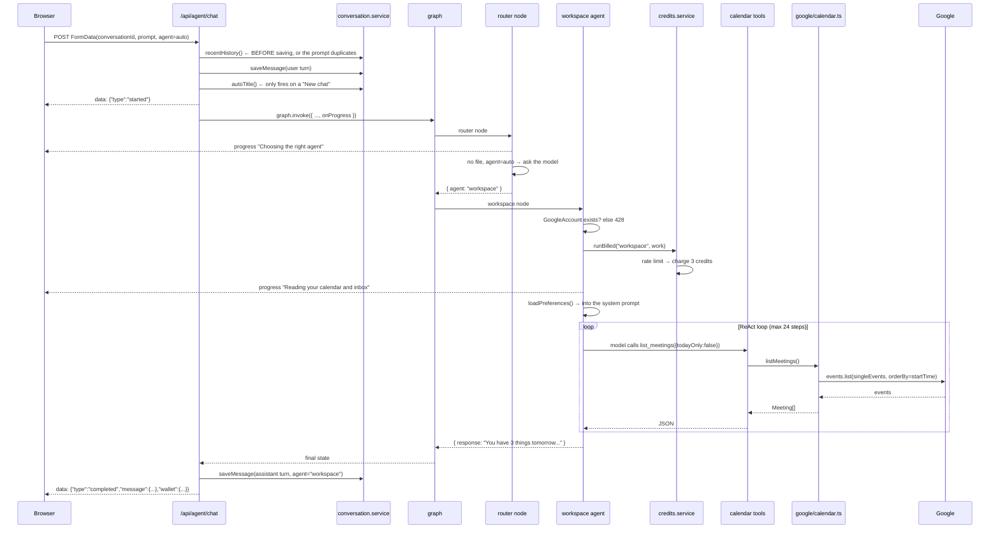
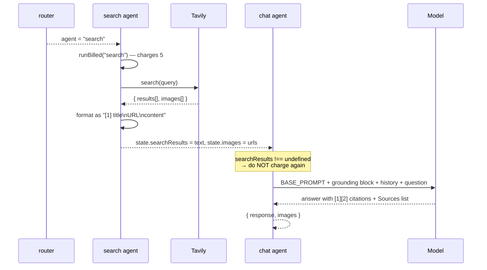
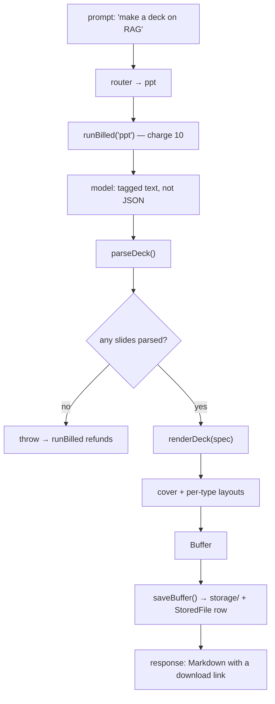
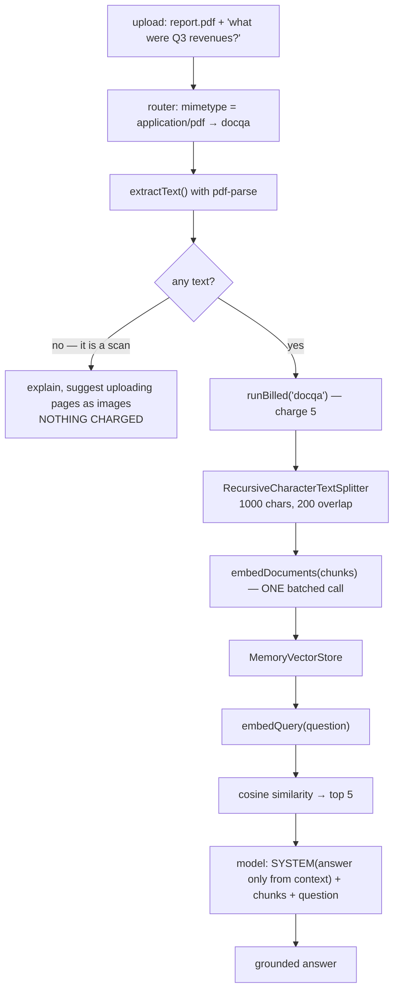
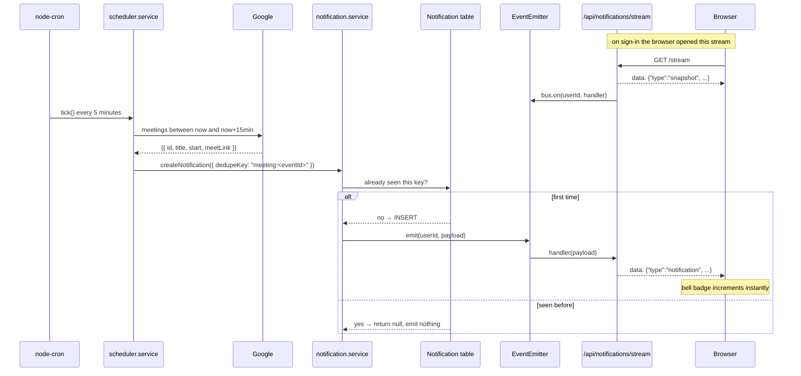
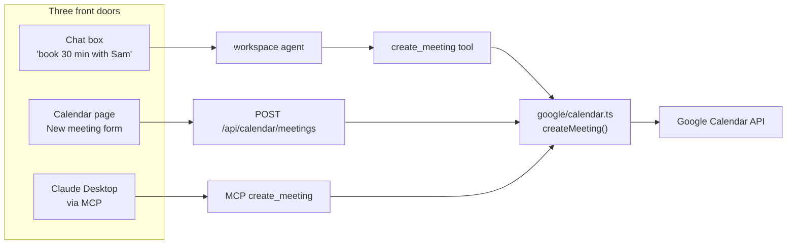
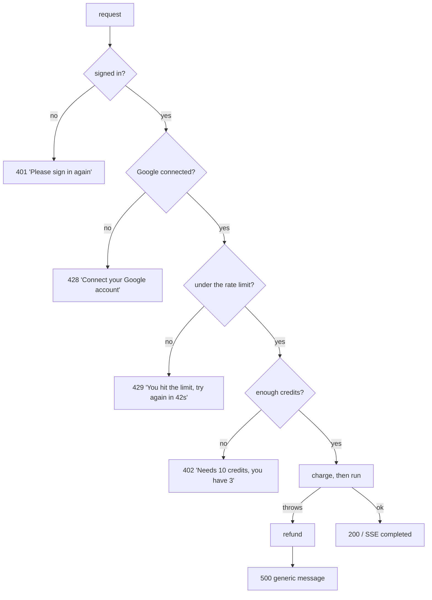

# 4. Data flows

Six real requests, traced end to end. If you want to understand how a piece of
the system works, find the flow that uses it and follow the arrows.

---

## 4.1 Signing in

One consent screen does three jobs: identify the user, grant Calendar, grant Gmail.

```mermaid
sequenceDiagram
    participant B as Browser
    participant A as /api/auth
    participant G as Google
    participant DB as Database

    B->>A: GET /google
    A->>A: mint random `state`, remember it (10 min TTL)
    A-->>B: 302 to Google consent
    Note over B,G: user approves sign-in + Calendar + Gmail
    G-->>B: 302 to /google/callback?code=...&state=...
    B->>A: GET /google/callback
    A->>A: consumeState() — CSRF check
    A->>G: exchange code for tokens
    G-->>A: access_token, refresh_token, scope
    A->>G: userinfo.get()
    G-->>A: id, email, name, picture
    A->>DB: upsert User
    A->>DB: upsert GoogleAccount (tokens)
    A-->>B: Set-Cookie: cortex_session=<jwt>; HttpOnly
    A-->>B: 302 to APP_URL/chat
```

**The detail that bites everyone:** Google only returns a `refresh_token` on the
**first** consent for an app. That is why `buildConsentUrl` sets both
`access_type: "offline"` and `prompt: "consent"`, and why `upsertUserFromGoogle`
keeps the existing refresh token when a re-consent arrives without one:

```ts
refreshToken: input.refreshToken ?? existing?.refreshToken ?? null,
```

Without that line, the second sign-in wipes the refresh token and the agent
silently stops working an hour later.

**Files:** `routes/auth.routes.ts` → `auth/google-oauth.ts` → `auth/session.ts`

---

## 4.2 "What's on my calendar tomorrow?"

The full path through the graph, including billing and streaming.



**Why history is loaded first.** If you saved the user's message before reading
history, the message would be in the history *and* appended as the current
turn — the model would see it twice and often answer as if asked twice.

**Why the Google check is before `runBilled`.** A missing grant surfaces as a
clear 428 instead of a tool error buried inside the ReAct loop, and nothing is
charged.

**Files:** `routes/agent.routes.ts` → `ai/graph.ts` → `ai/router.node.ts` →
`ai/agents/workspace.agent.ts` → `ai/tools/calendar.tools.ts` → `google/calendar.ts`

---

## 4.3 "What's the latest on X?" — the search hand-off

The only two-node path in the graph.



**The three-state field.** `searchResults` is `string | undefined`:

| Value | Means | What chat does |
|---|---|---|
| `undefined` | no search ran | answers normally, charges for `chat` |
| `""` | search ran, found nothing / no API key | answers from training data, adds "this may not be current" |
| text | search worked | cites `[1] [2]`, ends with Sources, **does not charge again** |

Numbering the results `[1]`, `[2]` matters: the chat prompt instructs the model
to cite by number, and those numbers have to line up with what it was shown.

**Files:** `ai/agents/search.agent.ts` → `ai/agents/chat.agent.ts`

---

## 4.4 "Make a deck about X"

The model writes a structure; code renders it.



The model is asked for this, **not** JSON:

```
TITLE: Retrieval Augmented Generation
SUBTITLE: Grounding models in your own data

SLIDE:
Type: bullets
Title: Why RAG
- Models have a training cutoff
- Fine-tuning is slow and expensive
...
```

**Why not JSON?** Model JSON fails a dozen ways — a trailing comma, a smart
quote, a stray ```` ```json ```` fence — and every failure throws away a call you
already paid for. A line-based format degrades instead: an unparsable line is
skipped and the rest still renders.

The slide `Type:` maps to a layout function:

| Type | Function | Look |
|---|---|---|
| `bullets` | `addBullets` | white, each point in a soft card |
| `stats` | `addStats` | dark, big numbers in columns |
| `conclusion` | `addConclusion` | accent colour, takeaways |

The PDF agent is the same shape with `SECTION:` / `P:` / `B:` tags.

**Files:** `ai/agents/ppt.agent.ts` → `generators/ppt.generator.ts` → `lib/storage.ts`

---

## 4.5 Chat with an uploaded PDF — RAG in full



**Extraction before billing.** A scanned PDF has no text layer. Parsing is local
and free, so it happens first and a scan costs the user nothing.

**Why 200 characters of overlap.** A hard split at 1000 characters can land in
the middle of the one sentence that answers the question, leaving half in each
chunk and neither retrievable. Overlap means every boundary appears whole in at
least one chunk.

**What cosine similarity actually is** — the whole of retrieval, in four steps:

1. every chunk becomes a vector (the embedding model does this)
2. the question becomes a vector the same way
3. score each chunk by how closely its vector points in the same direction
4. hand the top few to the model as context

```ts
similarity = dot(a, b) / (magnitude(a) * magnitude(b))
```

Dividing out the magnitudes is what makes a long chunk and a short chunk
comparable. `1` means identical direction, `0` means unrelated.

This is a linear scan, O(n) per query. For the few hundred chunks a document
produces that is microseconds. Millions of vectors is exactly when you reach for
a vector database and its approximate index.

**Files:** `ai/agents/docqa.agent.ts` → `ai/vector-store.ts` → `ai/models.ts`

---

## 4.6 A meeting reminder appears without a refresh



**`dedupeKey` is the whole trick.** The sweep runs every five minutes and a
meeting stays inside the 15-minute window for three consecutive ticks. Without
dedup you would get three identical reminders. With it, ticks 2 and 3 write
nothing.

**Listener cleanup matters.** `req.on("close")` removes the bus listener. Without
it every closed tab leaks a listener and the emitter eventually warns about
exceeding max listeners.

**Files:** `services/scheduler.service.ts` → `services/notification.service.ts`
→ `routes/notification.routes.ts` → `web/src/store/notification.store.ts`

---

## 4.7 The same tool, three ways in



| Door | Costs an LLM call | Credits | When it is the right one |
|---|---|---|---|
| Chat box | yes | 3 | vague or multi-step requests |
| Calendar page | no | 0 | you already know the exact details |
| MCP | the host's | 0 | working inside another tool |

This is why `google/calendar.ts` and `google/gmail.ts` contain **no framework
types** — no Express `Request`, no LangChain `tool()`. Keeping them as plain
functions is what lets all three share one implementation.

---

## 4.8 Where a request can fail, and what the user sees



Each of 401, 402, 428 and 429 is an `AppError` with a title and a message
written for a person. Everything else becomes a generic 500, because
`toErrorBody()` only echoes messages the app itself created — a stack trace or a
provider error string must never reach a chat bubble.

Once the SSE stream is open the headers are already sent, so errors travel as
`data: {"type":"error", ...}` events rather than HTTP status codes. The chat
store turns those into the red banner above the composer.
