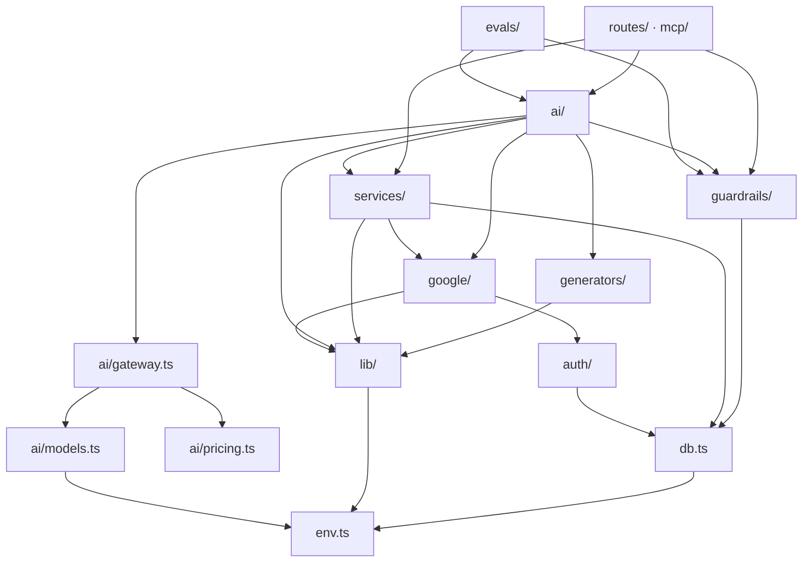

# 4. File guide

Every file, what it does, and what it depends on. Use this as a map while you write.

**Total: 90 source files** — 66 server, 24 web — plus 11 documents.

---

## 4.1 Folder shape

```
ai-secretary/
├── package.json              npm workspaces + the dev script
├── .env.example              every key, commented
├── Dockerfile                3-stage build: deps → build → runtime
├── docker-compose.yml        production-like stack: app + Postgres
├── .dockerignore             keeps secrets and junk out of image layers
├── .github/workflows/ci.yml  typecheck, build, run the offline evals
│
├── server/                   Node + Express + TypeScript
│   ├── prisma/schema.prisma  the data model
│   └── src/
│       ├── index.ts          process entry: listen + cron + shutdown
│       ├── app.ts            Express app: middleware + route table
│       ├── env.ts            all env vars, parsed once
│       ├── db.ts             the Prisma client singleton
│       ├── lib/              errors, SSE, storage, time
│       ├── auth/             Google OAuth, sessions, the auth gate
│       ├── guardrails/       policy, input, output, tool gate, trust boundary
│       ├── google/           Calendar and Gmail, framework-free
│       ├── ai/               the graph, agents, tools, models, gateway
│       ├── generators/       PDF and PPTX rendering
│       ├── services/         conversations, credits, limits, alerts, cron, traces
│       ├── routes/           the HTTP surface
│       ├── mcp/              Model Context Protocol server
│       └── evals/            the eval harness and its suites
│
└── web/                      React + TypeScript + Vite
    └── src/
        ├── main.tsx          mount
        ├── App.tsx           routes + the auth gate
        ├── index.css         design tokens + Markdown styling
        ├── lib/              API client, SSE reader, types
        ├── store/            Zustand stores
        ├── components/       layout + chat pieces
        └── pages/            the six screens
```

---

## 4.2 Server — foundation

| File | What it does | Why it exists |
|---|---|---|
| **`env.ts`** | Reads and validates every environment variable once, exports a frozen `env` object | Nothing else touches `process.env`. A missing key fails loudly at boot, not as `undefined` halfway through an agent run. |
| **`db.ts`** | The Prisma client singleton | Cached on `globalThis` because `tsx watch` re-imports modules on save, and a fresh client per reload leaks connections until SQLite refuses to open another. |
| **`app.ts`** | Express app: CORS, JSON, cookies, the route table, the error handler | Separate from `index.ts` so a test can import the app without starting a listener or a cron job. |
| **`worker.ts`** | The background worker as its own process: cron only, no HTTP | Needed past one instance, where every web process would otherwise run its own sweep. Refuses to start if `ENABLE_SCHEDULER` is false rather than idling silently. |
| **`index.ts`** | `listen()`, start the scheduler (unless a worker owns it), handle SIGINT/SIGTERM | Prints a startup banner showing what is and is not configured. Half of all "why isn't this working" time goes on a missing key. |
| **`prisma/schema.prisma`** | 9 models: User, GoogleAccount, Preference, Conversation, Message, Notification, StoredFile, PendingAction, Trace | Switch `provider` to `postgresql` and nothing else changes. |

### `lib/`

| File | What it does | The detail worth knowing |
|---|---|---|
| **`errors.ts`** | `AppError` + `toErrorBody()` + `statusOf()` | Only `AppError` messages reach the browser. Anything else becomes a generic 500, so internal details never leak into a chat bubble. |
| **`sse.ts`** | `openSseStream(res)` → `{ send, comment, close }` | A heartbeat comment every 25s keeps proxies from dropping an idle connection. `X-Accel-Buffering: no` stops nginx buffering the whole stream into one chunk at the end. |
| **`storage.ts`** | `saveBuffer()`, `resolveOwnedFile()`, `publicUrl()` | Deliberately narrow interface — swapping in S3 means rewriting this one file. |
| **`time.ts`** | `startOfToday()`, `humanTime()`, `parseJsonArray()` | One answer to "what counts as today", shared by the calendar tools, the cron and the prompts. |

### `auth/`

| File | What it does | The detail worth knowing |
|---|---|---|
| **`google-oauth.ts`** | Scope list, consent URL, code exchange, user upsert | `access_type: "offline"` + `prompt: "consent"` is what makes Google return a **refresh token**. Without it you get an access token that dies in an hour and the agent silently stops working. |
| **`session.ts`** | Sign / verify / clear the JWT cookie | 7-day expiry. A signed cookie cannot be revoked early, which is the trade for not running Redis. |
| **`require-auth.ts`** | The gate: verify cookie → load user → `req.user` | Loads the **row**, not just the token, so credit changes take effect immediately and a deleted account cannot keep using an old cookie. |

### `google/`

| File | What it does | The detail worth knowing |
|---|---|---|
| **`client.ts`** | Hands out authenticated `calendar` / `gmail` clients, each with a `GOOGLE_TIMEOUT_MS` deadline | The `tokens` listener catches a refreshed access token and writes it back, so token refresh lives in exactly one place. The timeout is set here rather than per call: the gateway bounds model calls, and without this a hung Google request would have no ceiling at all. |
| **`calendar.ts`** | `listMeetings`, `getMeeting`, `createMeeting`, `rescheduleMeeting`, `cancelMeeting`, `checkBusy`, `findFreeSlot` | `singleEvents: true` expands a recurring event into occurrences, which is what "my next three meetings" should mean. `conferenceDataVersion: 1` is required for Google to actually mint the Meet link. |
| **`gmail.ts`** | `listMail`, `readMail`, `sendMail`, `replyToMail`, `markMailRead`, `mailStats` | Bodies arrive base64url-encoded in a nested MIME tree, so `extractBody` walks it: prefers `text/plain`, falls back to `text/html` with tags stripped. Replying needs `threadId` **plus** `In-Reply-To`, or Gmail shows it as a new conversation. |

### `guardrails/`

The safety layer. Read [06-GUARDRAILS.md](06-GUARDRAILS.md) for why it is shaped
this way; this is what each file does.

| File | What it does | The detail worth knowing |
|---|---|---|
| **`policy.ts`** | Every threshold, pattern and tool list in one object | A reviewer can audit the whole policy in one screen, and tuning it never means touching enforcement logic. |
| **`input.guard.ts`** | Redacts credentials, blocks 3 intents, flags injection phrasing | Credentials are **redacted, not blocked** - a pasted stack trace should still get help. There is no PII redaction on purpose: email addresses are the subject matter here. |
| **`untrusted.ts`** | Wraps third-party content so the model reads it as data | The fence is a random string, and occurrences inside the content are filtered, so a crafted email cannot close the block early. |
| **`tool.guard.ts`** | The approval gate: `send_mail`, `reply_to_mail`, `cancel_meeting` propose instead of acting | The only guardrail that is not advisory. Also holds the per-turn write budget, keyed on a `turnId` so counts cannot leak between turns. |
| **`output.guard.ts`** | Catches prompt leaks, tool-sourced secrets, unsafe link schemes | A leaked system prompt replaces the whole answer rather than being patched. Runs **before persistence**, not just before display. |
| **`index.ts`** | The barrel, plus the diagram of the four layers | |

### `evals/`

| File | What it does |
|---|---|
| **`types.ts`** | `Suite`, `CaseResult`, and the offline/live split |
| **`guardrails.eval.ts`** | 26 cases. Includes 5 **false-positive guards** - inputs that must NOT trip a rule |
| **`parsers.eval.ts`** | 14 cases. The deck and document parsers must *degrade*, not throw; plus vector-store edge cases |
| **`router.eval.ts`** | 21 live routing-accuracy cases, 4 offline attachment cases, and **15 offline plan cases** — 10 for the parser rules and 5 that walk a plan to completion to prove it terminates |
| **`run.ts`** | The runner, 5 suites. `npm run eval` for offline, `-- --live` to add model calls. Exit 1 on failure, so it gates CI |

---

## 4.3 Server — the AI layer

| File | What it does | The detail worth knowing |
|---|---|---|
| **`ai/gateway.ts`** | `invokeModel()` - cache, timeout, retry, fallback, cost | The single door every model call goes through. `UsageMeter` flows through graph state, so the eight calls inside a ReAct loop all add to one total. |
| **`ai/pricing.ts`** | USD per million tokens, per model | Cost is computed in one place from provider-reported counts. An unlisted model costs 0, which shows up as a suspiciously free agent on Insights. |
| **`ai/models.ts`** | `getModel(role)`, `getFallbackModel(role)`, `getEmbeddings()` | Agents ask by **role** (`"router"`, `"vision"`), never by provider. Temperature is 0 where output is parsed by code, warmer where it is prose for a human. Models are cached per role. |
| **`ai/state.ts`** | The `GraphState` annotation | Read this first when you want to understand the graph. Every node reads it and returns a partial update. |
| **`ai/router.node.ts`** | Returns an ordered **plan** of agents | Three stages, cheapest first — see [03-ARCHITECTURE §3.4](03-ARCHITECTURE.md#how-the-router-decides--three-stages-cheapest-first). Parses the first valid word from the reply, because models answer `"Search."` and `"agent: coding"` often enough that a bare match is unsafe. |
| **`ai/embedding-cache.ts`** | Caches embeddings by content hash | An embedding is a pure function of (text, model), so caching cannot change a result — only skip paid work. Fixes doc Q&A re-embedding a PDF on every follow-up question. The model id is in the key because two embedding models produce vectors in **different spaces**, and mixing them wrecks retrieval silently. |
| **`ai/graph.ts`** | Wires nodes and edges, compiles once | Compilation validates the wiring, so a typo in a destination fails at boot rather than mid-conversation. Also exports `AGENT_CATALOG`, which the UI picker reads — the list can never drift from the graph. |
| **`ai/tools/context.ts`** | `ToolContext`, `tracked()`, `untrusted()` | Tools are built per run so they close over *this* turn's identity. `tracked()` returns tool errors as strings rather than throwing, so one failed call does not abort the ReAct loop. |
| **`ai/vector-store.ts`** | ~100-line cosine-similarity vector store | LangChain v1 dropped `MemoryVectorStore`, and running Qdrant for one throwaway document is operations work for nothing. This is also the clearest possible explanation of what retrieval actually is. |

### `ai/tools/`

| File | Tools | The detail worth knowing |
|---|---|---|
| **`calendar.tools.ts`** | 7 calendar tools | Thin wrappers. What they add is the **schema and the description** — that is the real prompt engineering, since the model only ever sees name + description + schema. |
| **`mail.tools.ts`** | 6 Gmail tools | `search_mail`'s description teaches the model Gmail query syntax, turning "any unread from Sam this week?" into one tool call instead of a listing the model then filters in its head. |
| **`notify.tools.ts`** | `create_reminder`, `list_notifications`, `remember_preference` | `remember_preference` is the long-term memory. Also exports `loadPreferences()`, used to build the workspace system prompt. |
| **`index.ts`** | `createWorkspaceTools(userId)` | Binds all three sets together. |

### `ai/agents/`

| File | Pattern | The detail worth knowing |
|---|---|---|
| **`workspace.agent.ts`** | **ReAct loop** | The heart of "chat with your calendar". Checks the Google grant *before* billing so a missing connection gives a clear message rather than a tool error deep in the loop. |
| **`chat.agent.ts`** | one-shot | Two entry paths: direct (charges for `chat`) or via search (does **not** charge again — the search node already billed). |
| **`search.agent.ts`** | one-shot, no prose | Fetch and format only. Numbers results `[1] [2]` so the chat prompt's citation instruction lines up. Degrades to empty results if there is no API key. |
| **`coding.agent.ts`** | one-shot | Emits either `FILE:` blocks (→ an artifact with tabs and a live preview) or Markdown (→ a review). The model signals which by whether it emits file blocks — simpler than a separate intent field to parse. |
| **`pdf.agent.ts`** | one-shot | Asks for **tagged plain text**, not JSON. JSON from a model fails a dozen ways and each failure throws away a paid call; a line format degrades instead — an unparsable line is skipped and the rest renders. |
| **`ppt.agent.ts`** | one-shot | Same tagged format, plus slide **types** (`bullets` / `stats` / `conclusion`) mapping to layout functions. |
| **`image.agent.ts`** | two-step | A text model first rewrites the request into a detailed image prompt. Bytes are downloaded and stored locally so the picture survives in the transcript. 90s abort timeout — the provider can hang. |
| **`vision.agent.ts`** | one-shot | Image passed inline as a base64 data URL. Checks `providerSupportsVision()` first for a clear message. |
| **`docqa.agent.ts`** | RAG pipeline | extract → split → embed → similarity search → grounded answer. Extraction happens **before** billing: a scanned PDF with no text layer should cost nothing. |

### `generators/`

| File | What it does | The detail worth knowing |
|---|---|---|
| **`pdf.generator.ts`** | `renderPdf(spec)` → Buffer | Kept apart from the agent so the layout is testable with a hand-written outline, no model needed. `bufferPages: true` is what allows stamping page numbers once the total is known. |
| **`ppt.generator.ts`** | `renderDeck(spec)` → Buffer | Four layout functions on a 13.33 × 7.5 inch canvas. The file opens with a documented cast: pptxgenjs's `export as namespace` makes TypeScript resolve the default export to the module object rather than the class. |

---

## 4.4 Server — services and routes

### `services/`

| File | What it does | The detail worth knowing |
|---|---|---|
| **`credits.service.ts`** | `runBilled(userId, agent, work)` | The wrapper every agent runs inside: rate limit → charge → run → refund on throw. One place, so no individual agent has to remember the ordering. |
| **`ratelimit.service.ts`** | Fixed-window counter per user per agent | In-memory `Map` with a sweep interval, `unref`'d so it does not hold the event loop open. |
| **`conversation.service.ts`** | Conversation CRUD + `recentHistory()` + `autoTitle()` | `assertOwned()` guards every function and answers **404**, never 403. |
| **`notification.service.ts`** | DB write + `EventEmitter` fan-out | `dedupeKey` turns a repeat into a no-op, which is what makes a 5-minute sweep safe. |
| **`trace.service.ts`** | One row per run; `getInsights()` aggregates | Deliberately boring - a table and two queries, not a tracing SDK. Writes are wrapped: telemetry never fails a request. |
| **`scheduler.service.ts`** | The `node-cron` sweep | One user's expired grant must not stop the sweep for everyone else, so each call is individually caught. |

### `routes/`

| File | Endpoints | Needs an LLM? |
|---|---|---|
| **`auth.routes.ts`** | `/google`, `/google/callback`, `/logout`, `/me`, `/google/disconnect` | no |
| **`agent.routes.ts`** | `POST /chat` (SSE), `GET /catalog` | **yes** |
| **`chat.routes.ts`** | conversation CRUD + transcripts | no |
| **`calendar.routes.ts`** | meetings CRUD, `/busy`, `/free-slot` | no |
| **`mail.routes.ts`** | messages, read, send, reply, stats | no |
| **`notification.routes.ts`** | list, mark read, clear, sweep, `GET /stream` (SSE) | no |
| **`file.routes.ts`** | list + download generated files | no |
| **`approval.routes.ts`** | list, approve, reject a proposed action | **never** |
| **`insights.routes.ts`** | telemetry summary, traces, live policy | no |

`agent.routes.ts` is the one worth reading closely. Order of operations matters:

1. load history **before** saving the new message, or the prompt appears twice in the model's context
2. open the SSE stream **before** invoking the graph, so progress events can be sent while it runs
3. delete the upload in `finally`, whichever agent ran and however it ended

It also brackets the run with guardrails: the input guard runs **before** the
stream opens (so a rejection is a plain 422), and the output guard runs before the
answer is **persisted**, not just before it is shown.

`approval.routes.ts` is the other file worth reading closely. Its defining
property is that **no model is involved**: it loads the stored arguments the user
actually saw and calls the Google function directly, so nothing can change what
runs after they agreed to it.

### `mcp/`

| File | What it does |
|---|---|
| **`mcp.tools.ts`** | Registers 10 tools on an `McpServer`, reusing `google/`. **Carries the same guardrails as the in-app agent** — listings wrapped as untrusted, `send_mail` and `cancel_meeting` propose rather than act. Skipping them would be a hole straight through the policy. |
| **`http.ts`** | `POST /mcp` over Streamable HTTP. Stateless: a fresh server per request, so a restart never strands a client. |
| **`stdio.ts`** | `npm run mcp` for Claude Desktop / Cursor. **stdout is the protocol channel**, so every log here goes to stderr. |

---

## 4.5 Web

| File | What it does | The detail worth knowing |
|---|---|---|
| **`vite-env.d.ts`** | Types `import.meta.env.VITE_*` | Three lines. Without it `api.ts` reading `VITE_API_URL` falls back to `any`. |
| **`lib/types.ts`** | Every API shape | Mirrors the server by hand. A shared package would remove the duplication but add a build step to a project whose point is being easy to follow. |
| **`lib/api.ts`** | The single HTTP client | `credentials: "include"` on every call, or the cookie is not sent and everything 401s. Unwraps error bodies into thrown `ApiError`. |
| **`lib/sse.ts`** | `streamAgentChat()`, `subscribeToNotifications()` | The manual SSE parser. Keeps the partial tail in a buffer because a network chunk does not align with an event boundary. |
| **`store/auth.store.ts`** | user, wallet, Google status | `status` starts as `"loading"`, not `"signed-out"` — otherwise every refresh flashes the login screen. |
| **`store/chat.store.ts`** | threads, transcript, the in-flight turn | `pending` holds the placeholder bubble; on `completed` it is swapped for the real persisted message, so the transcript never contains a message the server does not have. |
| **`store/notification.store.ts`** | bell state + SSE subscription | `connect()` is idempotent because React StrictMode mounts effects twice in dev and a second stream would double every notification. |
| **`App.tsx`** | Routes + `<Protected>` | The notification stream is tied to `status`, not to mount, because it needs a session to authenticate. |
| **`components/Layout.tsx`** | Left rail, header, credit counter, unread badge | |
| **`components/Markdown.tsx`** | `react-markdown` + `remark-gfm` | Styling lives in `index.css` under `.md` because react-markdown renders bare tags with no class hook. |
| **`components/chat/ConversationList.tsx`** | New / switch / rename / delete | Inline rename — one piece of local state for which row is editing. |
| **`components/chat/MessageBubble.tsx`** | One turn | Deliberately asymmetric: user turns are boxed, assistant turns are not. Boxing long structured answers makes tables and code blocks cramped. |
| **`components/chat/Composer.tsx`** | Agent picker, attachment, textarea, send | Enter sends, Shift+Enter newlines. The agent list comes from `/api/agent/catalog`, so the picker can never offer an agent that does not exist. |
| **`components/chat/ArtifactPanel.tsx`** | Code tabs + live preview | CSS and JS are **inlined** into the HTML before building the blob, because a blob document has no base URL so `<link href="style.css">` would resolve to nothing. `sandbox="allow-scripts"` without `allow-same-origin` walls generated code off from this origin. |
| **`pages/Login.tsx`** | One Google button | One consent does sign-in *and* Calendar *and* Gmail. There is no second "connect your calendar" step anywhere. |
| **`pages/Chat.tsx`** | The main screen | Auto-scrolls on every message and progress line, which is what makes streaming feel live. |
| **`pages/Calendar.tsx`** | List + create + cancel | `datetime-local` has no timezone, so `new Date(value)` reads it as local and `toISOString()` converts to the UTC instant Google wants. |
| **`pages/Mail.tsx`** | Two-pane inbox | The search box takes raw Gmail query syntax — the same strings the agent's `search_mail` tool builds. |
| **`pages/Notifications.tsx`** | The alert centre | Kept live by the SSE subscription in `App.tsx`. "Check now" triggers the sweep instead of waiting for the cron. |
| **`components/chat/ApprovalCard.tsx`** | Approve / reject an irreversible action | Shows the **full stored payload**, not the agent's summary of it — the summary is exactly what an injected instruction would have tampered with. |
| **`components/chat/UsageStrip.tsx`** | Tokens, cost, calls and guardrail flags under the last answer | A turn that quietly made nine model calls looks identical to one that made one. |
| **`pages/Files.tsx`** | Everything generated | Permanent index — links never expire, unlike presigned URLs. |
| **`pages/Insights.tsx`** | Cost, latency, guardrail activity, gateway state, live policy | The policy panel reads from the server, so the UI cannot drift from what is enforced. |

---

## 4.6 Deployment files

| File | What it does | The detail worth knowing |
|---|---|---|
| **`Dockerfile`** | Three stages: `deps` installs everything, `build` compiles, `runtime` starts clean and copies only what runs | The final image has no TypeScript compiler, no Vite and no source. `prisma generate` must run *inside* the image because the query engine is platform-specific. |
| **`docker-compose.yml`** | App + Postgres, with a healthcheck so the app does not migrate before the database accepts connections | A named volume for `storage/`, or every redeploy loses the files users generated. |
| **`.dockerignore`** | Excludes `node_modules`, `dist`, `.env`, `_legacy` | Keeps the build context small and stops local secrets entering an image layer. |
| **`.github/workflows/ci.yml`** | Typecheck, build, `npm run eval`; a second job applies the Postgres migrations to a real Postgres | The offline evals need no API key, which is the only reason this is a real gate rather than a job people learn to ignore. The migration job fails if a model changed without a migration. |
| **`server/scripts/postgres-schema.mjs`** | Generates `prisma/postgres/schema.prisma` from the SQLite schema (`npm run db:pg:sync`) | Prisma cannot pick a provider from an env var, so prod needs its own schema file. Generating it means the models are only ever written once. |
| **`server/prisma/postgres/migrations/`** | Committed Postgres migrations | What `migrate deploy` applies on boot. Create new ones with `npm run db:pg:migrate`. |

The entrypoint is `prisma migrate deploy --schema=prisma/postgres/schema.prisma && node dist/index.js`. Already-applied
migrations are skipped, so it is safe on every boot. **Never `db push` in
production** — it can drop columns to match the schema.

See [10-DEPLOYMENT](10-DEPLOYMENT.md) for the full procedure.

---

## 4.7 Dependency direction

Nothing below ever imports from above. If you find yourself wanting to, something is in the wrong layer.



`evals/` sits outside the runtime graph: it imports the guardrails and the router
to measure them, and nothing imports it back.

<!-- nav -->

---

[← Architecture](03-ARCHITECTURE.md) · [Index](README.md) · [Data flows →](05-DATA-FLOWS.md)
