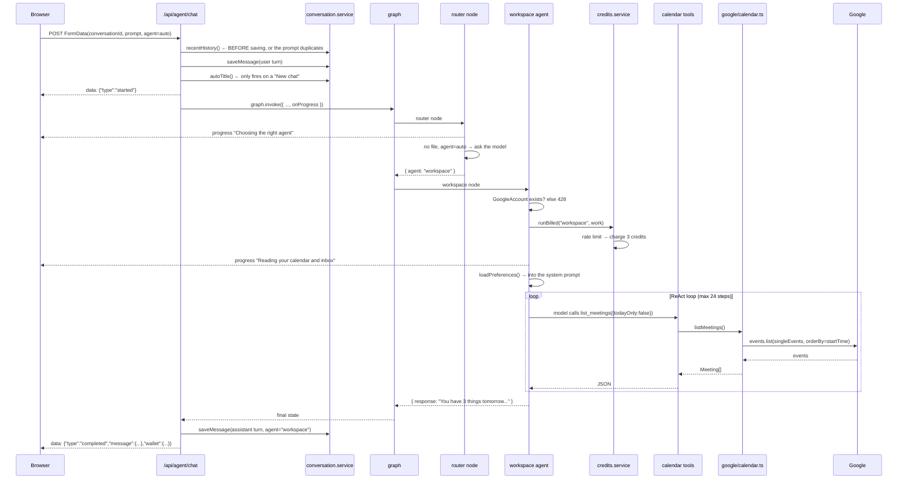
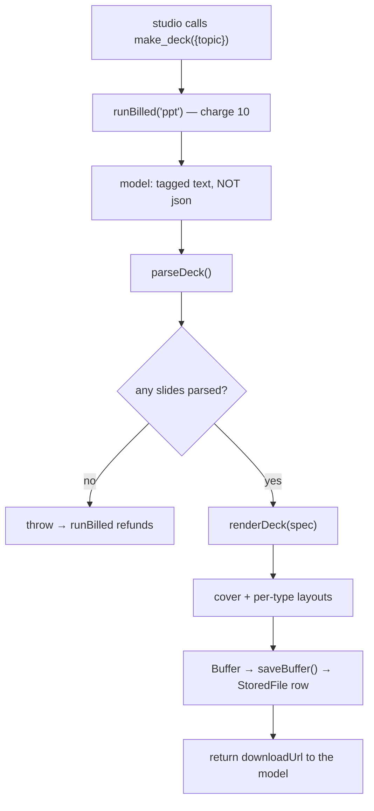
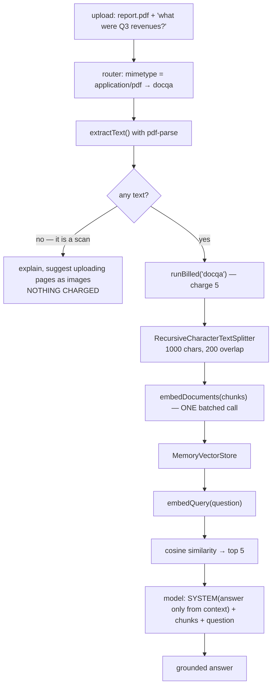
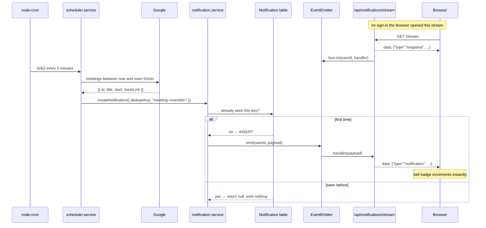
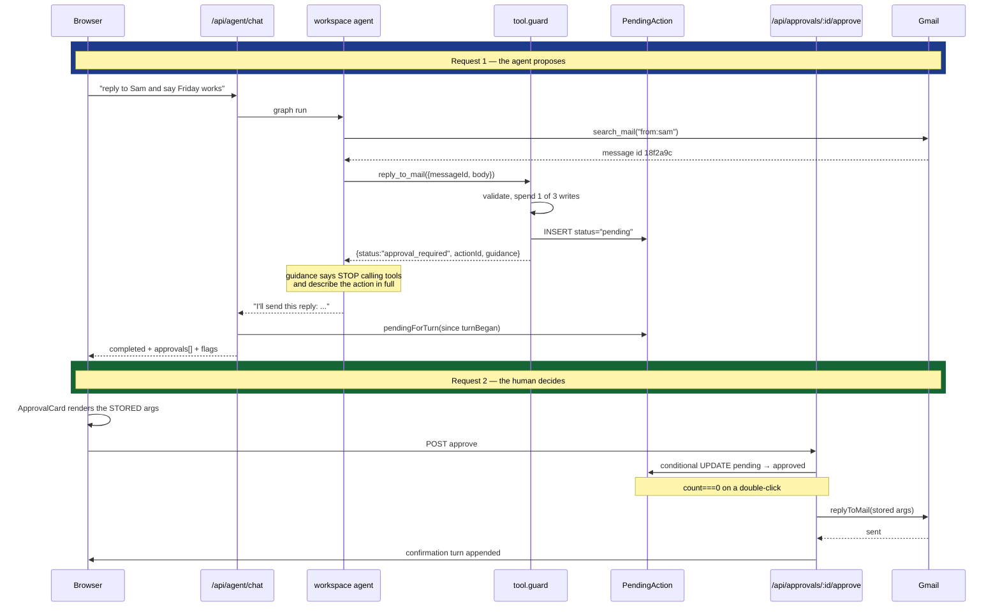
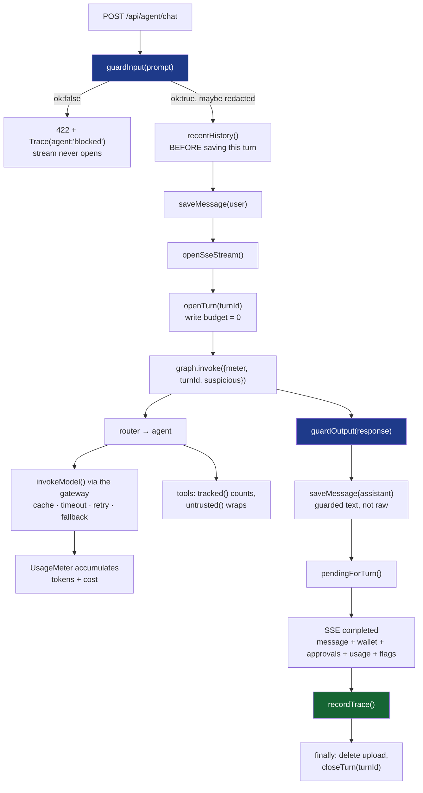
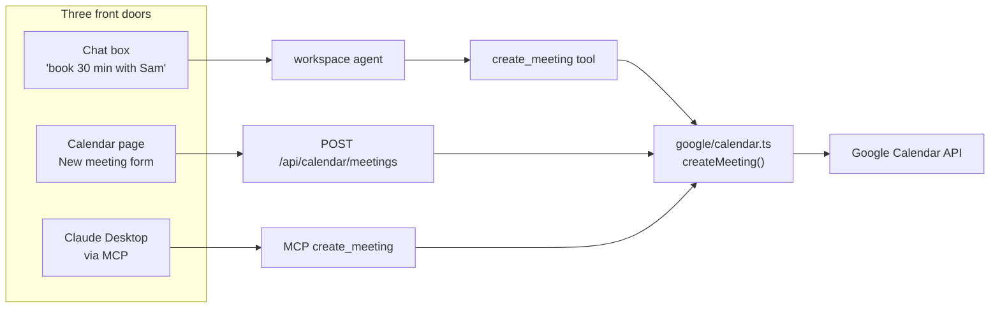
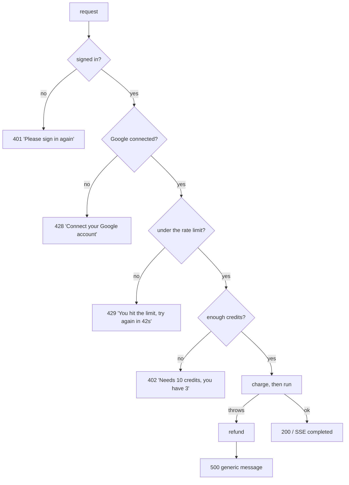

# 5. Data flows

Six real requests, traced end to end. If you want to understand how a piece of
the system works, find the flow that uses it and follow the arrows.

---

## 5.1 Signing in

One consent screen does three jobs: identify the user, grant Calendar, grant Gmail.

```mermaid
sequenceDiagram
    participant B as Browser
    participant A as /api/auth
    participant G as Google
    participant DB as Database

    B->>A: GET /google
    A->>A: mint random `state`, remember it (10 min TTL)
    A-->>B: 302 to Google consent
    Note over B,G: user approves sign-in + Calendar + Gmail
    G-->>B: 302 to /google/callback?code=...&state=...
    B->>A: GET /google/callback
    A->>A: consumeState() — CSRF check
    A->>G: exchange code for tokens
    G-->>A: access_token, refresh_token, scope
    A->>G: userinfo.get()
    G-->>A: id, email, name, picture
    A->>DB: upsert User
    A->>DB: upsert GoogleAccount (tokens)
    A-->>B: Set-Cookie: ai_secretary_session=<jwt>; HttpOnly
    A-->>B: 302 to APP_URL/chat
```

**The detail that bites everyone:** Google only returns a `refresh_token` on the
**first** consent for an app. That is why `buildConsentUrl` sets both
`access_type: "offline"` and `prompt: "consent"`, and why `upsertUserFromGoogle`
keeps the existing refresh token when a re-consent arrives without one:

```ts
refreshToken: input.refreshToken ?? existing?.refreshToken ?? null,
```

Without that line, the second sign-in wipes the refresh token and the agent
silently stops working an hour later.

**Files:** `routes/auth.routes.ts` → `auth/google-oauth.ts` → `auth/session.ts`

---

## 5.2 "What's on my calendar tomorrow?"

The full path through the graph, including billing and streaming.



**Why history is loaded first.** If you saved the user's message before reading
history, the message would be in the history *and* appended as the current
turn — the model would see it twice and often answer as if asked twice.

**Why the Google check is before `runBilled`.** A missing grant surfaces as a
clear 428 instead of a tool error buried inside the ReAct loop, and nothing is
charged.

**Files:** `routes/agent.routes.ts` → `ai/graph.ts` → `ai/router.node.ts` →
`ai/agents/workspace.agent.ts` → `ai/tools/calendar.tools.ts` → `google/calendar.ts`

---

## 5.3 "Research the latest on RAG and make a deck" — the studio loop

The flow that one-agent routing could not serve, and the reason the content
capabilities are tools.

```mermaid
sequenceDiagram
    participant B as Browser
    participant R as /api/agent/chat
    participant RT as router
    participant S as studio (ReAct)
    participant M as Model
    participant T as content tools
    participant G as Tavily / pptxgenjs

    B->>R: "research the latest on RAG and make a deck"
    R->>RT: graph.invoke
    RT-->>R: agent = "studio"
    R->>S: run

    S->>M: system prompt + 5 tool schemas + message
    M-->>S: call web_search({query:"latest RAG techniques 2026"})
    S->>T: web_search
    T->>G: Tavily
    G-->>T: 5 results
    Note over T: billed as "search"; results kept in<br/>outputs.research and wrapped as UNTRUSTED
    T-->>M: numbered, fenced results

    Note over M: READS the results before deciding
    M-->>S: call make_deck({topic:"..."})
    S->>T: make_deck
    Note over T: uses outputs.research as the source of fact
    T->>G: model writes outline -> pptxgenjs renders
    G-->>T: .pptx bytes -> saveBuffer
    T-->>M: {status:"created", downloadUrl, grounded:true}

    M-->>S: final message, no tool calls
    S-->>R: response + images + artifacts + flags
    R-->>B: completed
```

### What makes this impossible with a plan

The model **reads the search result before choosing the next step.** So:

| If the search… | The loop… |
|---|---|
| returns nothing | says so, and does **not** make a deck that implies it was researched |
| was too narrow | searches again with a better query |
| turns out unnecessary | skips it and generates directly |

A plan decided before any of that is known can only barrel on.

### Three details worth noticing

**Research is kept in a side channel, not in graph state.**

```ts
// server/src/ai/tools/content.tools.ts
outputs.research = result.text;        // a later make_deck reads this
outputs.images.push(...result.images.slice(0, 6));
```

A tool can only return a *string* to the model, so an image URL and a code
artifact need another route to the browser. `StudioOutputs` is that route; the
studio agent merges it into state after the loop ends. The same pattern
`counters` already uses for flags and tool counts.

**Search results are wrapped as untrusted content.**

```ts
return wrapUntrusted("web-search", result.text);
```

Web pages are third-party text, exactly like email bodies. Same guardrail
([06-GUARDRAILS §6.4](06-GUARDRAILS.md)).

**Each tool bills separately.**

```ts
const deck = await runBilled(userId, "ppt", () => makeDeck(topic, {...}));
```

So this turn costs `search` + `ppt`, and a malformed model response refunds
rather than charging for an empty deck. Per-turn budgets (3 searches, 2
generations) cap a confused loop.

**Files:** `ai/agents/studio.agent.ts` → `ai/tools/content.tools.ts` →
`ai/content/search.ts` + `ai/content/documents.ts` → `generators/ppt.generator.ts`

---

## 5.4 "Make a deck about X" — tagged text, not JSON

The generation step on its own, without research.



The model is asked for this, **not** JSON:

```
TITLE: Retrieval Augmented Generation
SUBTITLE: Grounding models in your own data

SLIDE:
Type: bullets
Title: Why RAG
- Models have a training cutoff
- Fine-tuning is slow and expensive
...
```

**Why not JSON?** Model JSON fails a dozen ways — a trailing comma, a smart
quote, a stray ```` ```json ```` fence — and each failure throws away a call you
already paid for. A line format **degrades**: an unparsable line is skipped and
the rest still renders.

The slide `Type:` maps to a layout function:

| Type | Function | Look |
|---|---|---|
| `bullets` | `addBullets` | white, each point in a soft card |
| `stats` | `addStats` | dark, big numbers in columns |
| `conclusion` | `addConclusion` | accent colour, takeaways |

`makePdf` is the same shape with `SECTION:` / `P:` / `B:` tags.

> 💡 The eval suite imports `parseDeck` and `parseOutline` **directly** and feeds
> them a code fence, a chatty preamble, a missing `Type:` line, an empty slide
> and total garbage. The last one must yield **zero** slides, so the agent
> refunds instead of charging.

**Files:** `ai/content/documents.ts` → `generators/ppt.generator.ts` →
`lib/storage.ts`

---

## 5.5 Chat with an uploaded PDF — RAG in full



**Extraction before billing.** A scanned PDF has no text layer. Parsing is local
and free, so it happens first and a scan costs the user nothing.

**Why 200 characters of overlap.** A hard split at 1000 characters can land in
the middle of the one sentence that answers the question, leaving half in each
chunk and neither retrievable. Overlap means every boundary appears whole in at
least one chunk.

**What cosine similarity actually is** — the whole of retrieval, in four steps:

1. every chunk becomes a vector (the embedding model does this)
2. the question becomes a vector the same way
3. score each chunk by how closely its vector points in the same direction
4. hand the top few to the model as context

```ts
similarity = dot(a, b) / (magnitude(a) * magnitude(b))
```

Dividing out the magnitudes is what makes a long chunk and a short chunk
comparable. `1` means identical direction, `0` means unrelated.

This is a linear scan, O(n) per query. For the few hundred chunks a document
produces that is microseconds. Millions of vectors is exactly when you reach for
a vector database and its approximate index.

**Files:** `ai/agents/docqa.agent.ts` → `ai/vector-store.ts` → `ai/models.ts`

---

## 5.6 A meeting reminder appears without a refresh



**`dedupeKey` is the whole trick.** The sweep runs every five minutes and a
meeting stays inside the 15-minute window for three consecutive ticks. Without
dedup you would get three identical reminders. With it, ticks 2 and 3 write
nothing.

**Listener cleanup matters.** `req.on("close")` removes the bus listener. Without
it every closed tab leaks a listener and the emitter eventually warns about
exceeding max listeners.

**Files:** `services/scheduler.service.ts` → `services/notification.service.ts`
→ `routes/notification.routes.ts` → `web/src/store/notification.store.ts`

---

## 5.7 "Reply to Sam and say Friday works" — the approval round trip

The flow that makes the guardrails real. Two HTTP requests, and **no model in the
second one**.



### Why this is two requests and not one

A single request would mean pausing the graph mid-run and resuming it later —
which needs a checkpointer, a resumable state store, and a way to reattach an SSE
stream. All solvable, all complexity.

Two requests needs a table row. The proposal is durable, so it survives a refresh
(`loadApprovals()` on mount brings the card back), and the approve path is a plain
POST with no streaming.

### The three details that matter

**1. The tool's return value is a prompt.**

```ts
return JSON.stringify({
  status: "approval_required",
  actionId: action.id,
  summary,
  guidance: [
    "This action has NOT happened yet and will not happen until the user",
    "approves it in the interface. Do not call this tool again.",
    "Write a short reply that states exactly what you are about to do",
    "(recipients, subject, and the full body if it is an email) so the user",
    "can check it before approving.",
  ].join(" "),
});
```

Tool results are an input channel. Telling the model *what happened* (nothing),
*what to do next* (describe it fully) and *what not to do* (retry) is what stops
it either claiming success or calling the tool again.

**2. The card shows stored arguments, not the agent's summary.**

```tsx
// web/src/components/chat/ApprovalCard.tsx
<Field label="To" value={(args.to as string[])?.join(", ")} />
<Field label="Subject" value={String(args.subject ?? "")} />
<dd className="whitespace-pre-wrap ...">{String(args.body ?? "")}</dd>
```

The summary is exactly what an injected instruction would have tampered with. The
user authorises the payload, not the description of it.

**3. The claim is atomic.**

```ts
const claimed = await prisma.pendingAction.updateMany({
  where: { id: actionId, status: "pending" },
  data:  { status: "approved" },
});

if (claimed.count === 0) return { ok: false, reason: "already_resolved" };
```

A double-click finds nothing still pending, so the email cannot go twice.

**Files:** `ai/tools/mail.tools.ts` → `guardrails/tool.guard.ts` →
`routes/approval.routes.ts` → `web/src/components/chat/ApprovalCard.tsx`

---

## 5.8 One turn, with every guardrail and the telemetry

The same request as §5.2, but showing what wraps it. This is the shape of *every*
agent turn.



### Ordering decisions, each for a reason

| Step | Why there |
|---|---|
| input guard **before** the stream opens | a rejection can be a plain 422; once headers are sent you cannot set a status |
| history **before** saving the turn | otherwise the prompt is in the history *and* the current turn, and the model answers as if asked twice |
| `openTurn` **before** `graph.invoke` | the write budget must exist before any tool can spend from it |
| output guard **before** `saveMessage` | a leaked secret in the database is still leaked |
| `recordTrace` in both branches | a failed run is the most interesting kind to have data about |
| `closeTurn` in `finally` | the budget must not outlive the turn, whatever happened |

### What the browser gets back

```json
{
  "type": "completed",
  "message": { "id": "...", "role": "assistant", "content": "...", "agent": "workspace" },
  "wallet": { "credits": 487, "totalCredits": 500 },
  "approvals": [],
  "usage": { "inputTokens": 2104, "outputTokens": 186, "costUsd": 0.0011,
             "modelCalls": 3, "cacheHits": 0, "retries": 0, "fallbacks": 0 },
  "flags": []
}
```

`usage` and `flags` render as the strip under the answer
([`UsageStrip.tsx`](../web/src/components/chat/UsageStrip.tsx)), and the same
numbers go to the `Trace` row that the Insights page aggregates.

> 💡 Putting cost in the product, not only a dashboard, is how you notice that a
> prompt change doubled it — on the same screen where you would notice the answer
> got worse.

**Files:** `routes/agent.routes.ts` is the whole flow in one file, ~240 lines.

---

## 5.9 The same tool, three ways in



| Door | Costs an LLM call | Credits | When it is the right one |
|---|---|---|---|
| Chat box | yes | 3 | vague or multi-step requests |
| Calendar page | no | 0 | you already know the exact details |
| MCP | the host's | 0 | working inside another tool |

This is why `google/calendar.ts` and `google/gmail.ts` contain **no framework
types** — no Express `Request`, no LangChain `tool()`. Keeping them as plain
functions is what lets all three share one implementation.

---

## 5.10 Where a request can fail, and what the user sees



Each of 401, 402, 428 and 429 is an `AppError` with a title and a message
written for a person. Everything else becomes a generic 500, because
`toErrorBody()` only echoes messages the app itself created — a stack trace or a
provider error string must never reach a chat bubble.

Once the SSE stream is open the headers are already sent, so errors travel as
`data: {"type":"error", ...}` events rather than HTTP status codes. The chat
store turns those into the red banner above the composer.

<!-- nav -->

---

[← File guide](04-FILE-GUIDE.md) · [Index](README.md) · [Guardrails →](06-GUARDRAILS.md)
