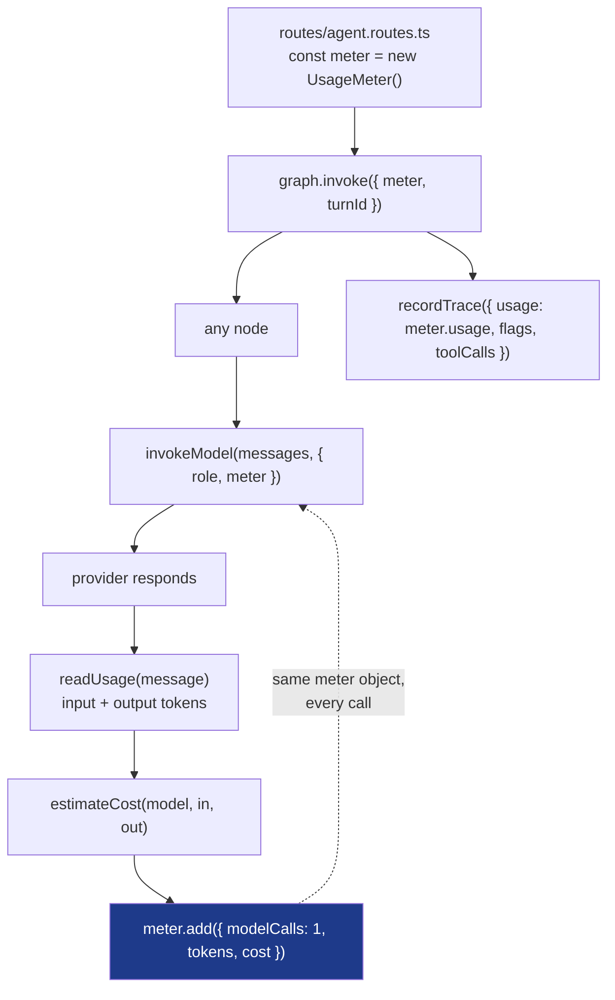

# 12. Observability

How a run is recorded, what is measured, what is deliberately not logged, and
where to look when something is slow, expensive or odd.

An agent is opaque by default. A turn that quietly made nine model calls and a
turn that made one look **identical** in the transcript. This is the subsystem
that fixes that.

| § | |
|---|---|
| [12.1](#121-the-three-questions-this-answers) | The three questions this answers |
| [12.2](#122-what-one-run-records) | What one run records |
| [12.3](#123-how-the-numbers-are-collected) | How the numbers are collected |
| [12.4](#124-the-metrics) | The metrics |
| [12.5](#125-guardrail-flags) | Guardrail flags |
| [12.6](#126-what-is-deliberately-not-logged) | What is deliberately **not** logged |
| [12.7](#127-the-insights-page) | The Insights page |
| [12.8](#128-using-it-to-debug) | Using it to debug |
| [12.9](#129-what-this-is-not) | What this is not |

---

## 12.1 The three questions this answers

Everything here exists to answer one of these. If a metric answers none of
them, it is noise.

**1. What is this costing, and which agent is responsible?**

Token counts come back from the provider, cost is computed in one place
([`ai/pricing.ts`](../server/src/ai/pricing.ts)), and the Insights page breaks
it down per agent. You find out before the invoice does.

**2. Why is it slow?**

p50 and p95 per agent, plus how many model calls and tool calls a run made. A
`workspace` turn at 11 seconds with eight model calls is a different problem
from one at 11 seconds with one.

**3. Which guardrails are actually firing?**

A rule that fires 400 times a day is probably mistuned. A rule that has never
fired is either dead code or protecting against something that is not
happening. **You cannot tell which without the count** — and a guardrail nobody
can see is a guardrail nobody will maintain.

---

## 12.2 What one run records

One `Trace` row per agent run, written in both the success and the failure path.

```prisma
model Trace {
  id             String   @id @default(cuid())
  userId         String
  conversationId String?
  agent          String       // which of the 9 ran, or "blocked"
  latencyMs      Int          // graph.invoke() to final state
  inputTokens    Int
  outputTokens   Int
  costUsd        Float        // estimated, from ai/pricing.ts
  modelCalls     Int          // includes every call inside a ReAct loop
  toolCalls      Int
  flags          String       // JSON array of guardrail labels
  ok             Boolean
  errorTitle     String?      // the AppError title, never the stack
  createdAt      DateTime @default(now())
}
```

Three design choices in that schema worth noticing:

**`agent` can be `"blocked"`.** When the input guard rejects a prompt, no agent
runs — but a row is still written. Blocked attempts are the most interesting
thing to be able to count, and discarding them would make the guardrails
invisible in exactly the case that matters.

**`modelCalls` counts the whole run, not one call.** The workspace agent can
make eight model calls in one turn. All eight land in one row, because the
question is "what did this *turn* cost".

**`errorTitle`, not the error.** `AppError` titles are short, written for a
person, and created by this app — so they are safe to store. A provider error
string or a stack trace is not.

---

## 12.3 How the numbers are collected

The mechanism is a `UsageMeter` threaded through graph state. That is what makes
a multi-call run countable.



The meter is a plain object passed by reference, so a loop that calls the
gateway eight times accumulates into one total:

```ts
// server/src/ai/gateway.ts
meter?.add({
  modelCalls: 1,
  inputTokens: inTok,
  outputTokens: outTok,
  costUsd: estimateCost(modelIdFor(role), inTok, outTok),
  retries: attempt,
});
```

Tool calls and guardrail flags come back a different way — through graph state,
because tools run inside the agent, not inside the gateway:

```ts
// server/src/ai/tools/context.ts — every tool is wrapped in this
export function tracked<Args>(counters, name, handler) {
  return async (args: Args): Promise<string> => {
    counters.calls += 1;
    try {
      return JSON.stringify(await handler(args));
    } catch (error) {
      flag(counters, `tool.error.${name}`);
      return JSON.stringify({ error: ..., guidance: ... });
    }
  };
}
```

The agent returns `{ flags: counters.flags, toolCalls: counters.calls }` into
state, and `flags` uses an **appending reducer**, because several guards can
fire in one run:

```ts
// server/src/ai/state.ts
flags: Annotation<string[]>({
  reducer: (previous, next) => [...new Set([...(previous ?? []), ...next])],
  default: () => [],
}),
```

> ⚠️ **Writing a trace never fails a request.** `recordTrace` wraps the insert
> in try/catch and logs a warning. Telemetry is not worth losing a user's answer
> over.

---

## 12.4 The metrics

### Latency

| Metric | Where | Why |
|---|---|---|
| p50 | Insights header | the typical experience |
| p95 | Insights header | the slow tail, which is what people complain about |
| avg per agent | Insights table | tells you *which* agent is slow |
| `modelCalls` / `toolCalls` | trace row | tells you *why* — round trips, not model speed |

Percentiles are computed in JavaScript, not SQL:

```ts
// server/src/services/trace.service.ts
function percentile(sorted: number[], fraction: number) {
  if (sorted.length === 0) return 0;
  const index = Math.min(sorted.length - 1, Math.ceil(fraction * sorted.length) - 1);
  return sorted[Math.max(0, index)];
}
```

Nearest-rank, and honest about being approximate at small sample sizes — which
this always is. SQLite has no percentile function, and the alternative is three
round trips and a window function nobody will want to read next year.

### Cost

Computed from provider-reported token counts in exactly one place:

```ts
export function estimateCost(model: string, inputTokens: number, outputTokens: number) {
  const price = priceFor(model);
  return (inputTokens / 1_000_000) * price.inputPerMillion
       + (outputTokens / 1_000_000) * price.outputPerMillion;
}
```

> 💡 An unlisted model costs **0**, which shows up as a suspiciously free agent
> on the Insights page. That is the intended signal to add it to
> `ai/pricing.ts` — a silent zero is better than a confidently wrong number.

Zero tokens means *"the provider did not report usage"*, not *"it was free"*.
Not every provider returns `usage_metadata`.

### Gateway and cache

```ts
// cacheStats() — surfaced on the Insights page
{
  entries, maxEntries,
  hits, misses, evictions,
  hitRate,        // null when nothing has been looked up yet
  ttlMs,
  cacheableRoles, // the explicit allowlist
}
```

`hitRate` is `null` rather than `0` before the first lookup, because **"no
data" and "0% hit rate" mean very different things** and a dashboard that
conflates them sends you debugging a cache that was never used.

A cache with no hit rate is a cache nobody can tune: a working cache and a cache
that never hits look identical from outside.

### Safety

Counted per flag over the window — see [§12.5](#125-guardrail-flags).

---

## 12.5 Guardrail flags

Every guard contributes labels to the run. They are machine-shaped on purpose
(stable, greppable, safe to aggregate) and translated for display.

| Flag | Raised by | Means |
|---|---|---|
| `input.redacted.<type>` | input guard | a credential was stripped before it reached a provider |
| `input.injection_suspected` | input guard | override-style phrasing; the agent got a defensive note |
| `input.too_long` | input guard | over `maxPromptLength`, rejected before any model call |
| `content.blocked.<label>` | input guard | a refused intent (`mass_mail`, `exfiltration`, `credential_phishing`) |
| `guardrail.untrusted_instruction_seen` | tool wrapper | retrieved content contained an embedded instruction |
| `guardrail.approval_requested` | tool guard | an irreversible action was proposed |
| `tool.error.<tool>` | tool wrapper | a tool failed and the model was told so |
| `output.prompt_leak` | output guard | the answer quoted the system prompt and was replaced |
| `output.redacted.<type>` | output guard | a credential arrived via a tool result |
| `output.unsafe_link` | output guard | a non-http(s) link scheme was stripped |

Two of these are worth reading as a pair:

`guardrail.untrusted_instruction_seen` **gates nothing**. It exists purely so
that an attempted indirect prompt injection is *visible* rather than silent —
you can see that the agent read an email containing an embedded instruction,
which is otherwise completely invisible.

`output.prompt_leak` means the answer was **replaced wholesale**, not patched. A
partly redacted system prompt is still a leaked system prompt.

They surface in two places: the strip under the last answer
([`UsageStrip.tsx`](../web/src/components/chat/UsageStrip.tsx)) and the Insights
page, ranked by frequency.

---

## 12.6 What is deliberately not logged

As important as what is. Every line here is a decision.

| Never recorded | Why |
|---|---|
| Prompt or answer text | a `Trace` row is metadata. The conversation is already in `Message`, scoped to its owner |
| Email bodies, subjects, sender addresses | third-party personal data that belongs in Gmail, not in a metrics table |
| OAuth access or refresh tokens | they live in `GoogleAccount` and never reach a log |
| API keys | the input and output guards redact eight credential shapes *before* persistence |
| Stack traces | `errorTitle` holds an `AppError` title the app wrote itself |
| Provider error strings | may quote the request, which may quote user content |

The output guard runs **before `saveMessage`**, not just before display:

```ts
// routes/agent.routes.ts
const outputVerdict = guardOutput(result.response || "...");

const saved = await saveMessage({
  content: outputVerdict.value,   // the guarded text, never the raw text
  ...
});
```

A secret sitting in the database is still leaked, even if the browser never
rendered it.

> ⚠️ **In development `app.ts` logs `req.method` and `req.originalUrl`.** Paths
> only, never bodies. It is disabled when `NODE_ENV=production`. If you add
> request-body logging for debugging, remember that `/api/agent/chat` bodies
> contain whatever the user typed.

---

## 12.7 The Insights page

[`web/src/pages/Insights.tsx`](../web/src/pages/Insights.tsx) ·
`GET /api/insights`

```
┌─ Insights ─────────────── last 7 days ──┐
│  Runs 142    Spend $0.0431              │
│  98% ok      28,104 tokens              │
│  p50 2.1s    p95 7.4s                   │
├─────────────────────────────────────────┤
│  By agent                               │
│  workspace  64  3.2s  $0.0180   0%      │
│  chat       41  1.4s  $0.0061   0%      │
│  ppt         9  8.8s  $0.0124   11%     │
├─────────────────────────────────────────┤
│  Guardrails fired                       │
│  Human approval required  ████████  18  │
│  Injection phrasing       ███       7   │
│  Redacted openai key      █         2   │
├─────────────────────────────────────────┤
│  LLM gateway                            │
│  provider google   fallback groq        │
│  model timeout 60s  tool timeout 20s    │
│  cache 12/500  hit rate 64% (18/28)     │
├─────────────────────────────────────────┤
│  Active guardrail policy  ← from server │
│  Needs approval: send_mail, reply_to…   │
└─────────────────────────────────────────┘
```

**The policy panel reads from the server**, via `GET /api/insights/policy`:

```ts
res.json({
  policy: {
    maxPromptLength: POLICY.input.maxPromptLength,
    secretTypesDetected: POLICY.input.secretPatterns.map((e) => e.label),
    blockedIntents: POLICY.content.blockedIntents.map((e) => e.label),
    requiresApproval: POLICY.tool.requiresApproval,
    maxWritesPerTurn: POLICY.tool.maxWritesPerTurn,
    maxRecipientsPerMessage: POLICY.tool.maxRecipientsPerMessage,
  },
});
```

So the UI shows **what the server is really enforcing**, not a hardcoded list in
the frontend that drifts out of date after someone edits `policy.ts`.

The regex patterns stay server-side. Publishing the exact injection patterns is
a free hint sheet for anyone trying to get around them.

---

## 12.8 Using it to debug

| Symptom | Where to look | What it usually means |
|---|---|---|
| "It feels slow" | p95 vs p50 per agent | a long tail in one agent, not a general problem |
| One agent is slow | `modelCalls` on its traces | a ReAct loop taking many round trips, not a slow model |
| Cost jumped | per-agent spend | usually `ppt`/`pdf`/`coding` — the high `maxTokens` roles |
| Cost shows $0.00 | `ai/pricing.ts` | the model id is unlisted, or the provider reports no usage |
| Answers feel stale | cache hit rate + `cacheableRoles` | only `router` is cacheable; if a creative role appears there, that is the bug |
| A guardrail seems off | flag counts | 400/day means mistuned; 0 ever means dead or unneeded |
| Retries climbing | `retries` in the usage strip | provider instability — set `LLM_FALLBACK_PROVIDER` |
| Mail agent acting oddly | `guardrail.untrusted_instruction_seen` | it read an email containing an embedded instruction |

### Verify it end to end

```bash
# 1. send a couple of messages in the UI, then:
curl -s -H "Cookie: ai_secretary_session=<yours>" \
  http://localhost:4000/api/insights | python -m json.tool | head -40

# 2. the live policy the server is enforcing
curl -s -H "Cookie: ai_secretary_session=<yours>" \
  http://localhost:4000/api/insights/policy
```

Ask the same question twice and the router `cacheHits` should increment on the
second — that is the cache proving itself.

---

## 12.9 What this is not

Being clear about the ceiling:

| Not included | Why, and what you would add |
|---|---|
| Distributed tracing | one process, so there are no spans to correlate across services. OpenTelemetry is the answer once there are |
| Log aggregation | `console.log` to stdout, which every host captures. Pino + a shipper if you need search |
| Alerting | nothing pages anyone. Sentry for errors; a scheduled query for cost thresholds |
| Per-span timing | `latencyMs` is the whole run. Model vs tool time would need per-call timing in the meter — a small, worthwhile addition |
| Retention policy | one row per run, growing forever. See [10-DEPLOYMENT §10.10](10-DEPLOYMENT.md#1010-day-two-operations) for the prune query |
| Request correlation id | the trace id is per run, not per HTTP request. The same thing at this size; not the same once there is a queue |

> 💡 The honest framing for an interview: *"I made the existing numbers reliable
> and visible before adding an observability stack. OpenTelemetry is the right
> next step, and it is the right next step **because** there would then be more
> than one process to correlate across — not because it looks impressive."*

<!-- nav -->

---

[← Interview guide](11-INTERVIEW-GUIDE.md) · [Index](README.md) · [Decisions →](13-DECISIONS.md)
