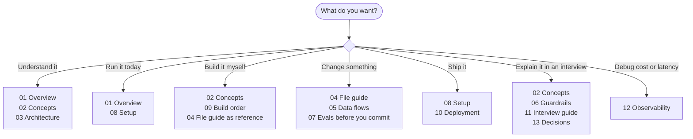

# AI Secretary documentation

Fourteen documents, in reading order. Each one ends with a link to the next, so you
can start at the top and keep going.

---

## Read in order

| # | Document | What you get | Time |
|---|---|---|---|
| 01 | [Overview](01-OVERVIEW.md) | What this is, what it does, a 10-minute tour of the whole system | 10 min |
| 02 | [Concepts](02-CONCEPTS.md) | **Every concept, taught with the actual code.** Agents, tools, LangGraph, ReAct, RAG, MCP, SSE, OAuth, injection | 60 min |
| 03 | [Architecture](03-ARCHITECTURE.md) | The design and every trade-off, with diagrams | 25 min |
| 04 | [File guide](04-FILE-GUIDE.md) | All 90 files: what each does and the one detail worth knowing | 30 min |
| 05 | [Data flows](05-DATA-FLOWS.md) | Eight real requests traced end to end | 25 min |
| 06 | [Guardrails](06-GUARDRAILS.md) | The four safety layers, and the attack that shapes them | 25 min |
| 07 | [Evals and gateway](07-EVALS.md) | How correctness is measured; retries, fallback, cost | 20 min |
| 08 | [Setup](08-SETUP.md) | Google Cloud, keys, MCP config, troubleshooting | 20 min doing |
| 09 | [Build order](09-BUILD-ORDER.md) | Type it out yourself, 16 checkpoints | 12 hrs doing |
| 10 | [Deployment](10-DEPLOYMENT.md) | Docker, Postgres, four hosting options, SSL, migrations | 45 min doing |
| 11 | [Interview guide](11-INTERVIEW-GUIDE.md) | Every question you will be asked, and how to answer it | 45 min |
| 12 | [Observability](12-OBSERVABILITY.md) | What a run records, the metrics, what is **not** logged, the Insights page | 20 min |
| 13 | [Decisions](13-DECISIONS.md) | 15 architecture decisions, each with its trade-off and "revisit when" | 20 min |

---

## Or pick a path

### I want to understand how it works
**01 → 02 → 03.** Then open
[`server/src/ai/graph.ts`](../server/src/ai/graph.ts) — 130 lines, and the whole
agent system fits in your head from there.

### I want it running on my machine
**01 → 08.** Two keys needed: a Google OAuth client and one LLM key.

### I want to write this code myself
**02 → 09**, with **04** open beside you. 16 stages, each ending in something you
can run.

### I am about to change something
**04** to find the file, **05** to see what it is part of, then
`npm run eval` before you commit.

### I want to deploy it
**08 → 10.** Docker Compose, Fly, Railway and a plain VPS are all covered.

### I have an interview on this
**02 → 06 → 11 → 13.** Doc 11 has the questions and answers; doc 13 has the
decisions with their trade-offs, which is what "defend it" actually means.

### Something is slow, expensive or behaving oddly
**12 Observability.** Which metric answers which question, and how to read the
Insights page.

---

## The 30-second version

A TypeScript multi-agent assistant. A **router** picks one of nine agents; eight
answer in a single pass, and the ninth (`workspace`) is a **ReAct loop** holding
16 Google Calendar, Gmail and notification tools.

Four things make it more than a demo:

| | |
|---|---|
| **Guardrails** | irreversible actions need human approval, and the approve step runs with no model involved |
| **Evals** | 44 offline cases, no API key, runnable in CI |
| **Gateway** | one place for retry, timeout, fallback, caching and cost |
| **Traces** | one row per run, surfaced on an Insights page |

---

## Conventions used throughout

| Symbol | Means |
|---|---|
| `file.ts:42` | a specific line, usually worth opening |
| ⚠️ | something that will bite you once |
| **DEGRADE** | behaviour on malformed input: carry on, do not throw |
| 💡 | an interview-worthy point |

Diagrams are [Mermaid](https://mermaid.js.org/), which GitHub renders natively.

<!-- nav -->

---

[Overview →](01-OVERVIEW.md)
